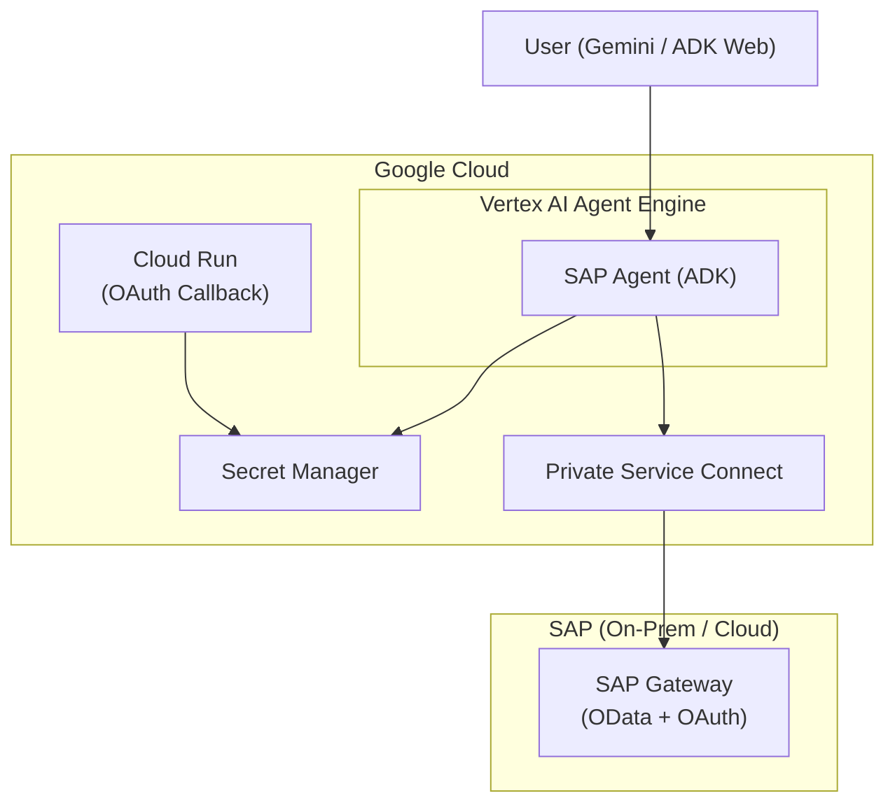

# SAP Agent with Google ADK

An AI agent that connects to SAP Gateway OData services, built with [Google Agent Development Kit (ADK)](https://google.github.io/adk-docs/) and deployed to [Gemini Enterprise](https://cloud.google.com/gemini/enterprise) via [Vertex AI Agent Engine](https://cloud.google.com/vertex-ai/docs/reasoning-engine/overview).

[](https://opensource.org/licenses/Apache-2.0)
[](https://www.python.org/)
[](https://google.github.io/adk-docs/)

---

## What It Does

This project deploys an **SAP-connected AI agent to Gemini Enterprise** so that end users can query SAP data using natural language — directly from the Gemini chat interface.

**The goal**: Let business users ask questions about SAP data without knowing OData, transaction codes, or entity set names. The agent handles authentication, service discovery, and query construction automatically.

```
User: "Show me all airlines"
Agent: authenticates → discovers Z_TRAVEL_RECO_SRV → queries AirlineSet → presents results

User: "Get sales order 91000092"
Agent: queries Z_SALES_ORDER_GENAI_SRV / zsd004Set(Vbeln='91000092') → presents details
```

**How it works end-to-end:**

1. The agent is built with **Google ADK** as a set of Python tool functions (`sap_authenticate`, `sap_query`, `sap_list_services`, `sap_get_entity`)
2. It is deployed to **Vertex AI Agent Engine** — Google Cloud's serverless runtime for AI agents
3. The deployed agent is registered in **Gemini Enterprise**, where end users interact with it through the Gemini chat UI
4. Each user authenticates with their own **SAP credentials via OAuth 2.0** (Authorization Code + PKCE), so all queries execute under that user's SAP PFCG authorization
5. A **Cloud Run OAuth callback proxy** handles the SAP login redirect automatically — no manual code copy-paste required
6. **Private Service Connect (PSC)** provides secure network connectivity from Agent Engine to on-premises SAP systems

## Architecture



## Agent Tools

| Tool | Description |
|------|-------------|
| `sap_authenticate` | SAP OAuth login with PKCE. Step 1: returns login URL. Step 2: auto-detects login via Cloud Run callback. |
| `sap_list_services` | Lists configured SAP OData services from `services.yaml` |
| `sap_query` | Queries OData entity sets with `$filter`, `$select`, `$top`, `$skip` |
| `sap_get_entity` | Retrieves a single entity by key |

## Project Structure

```
sap-adk-agent/
├── sap_agent/
│   ├── agent.py                    # Agent definition, tools, model config
│   ├── sap_auth_config.py          # ADK AuthConfig for SAP OAuth
│   ├── services.yaml               # SAP OData service definitions
│   └── sap_gw_connector/
│       ├── config/
│       │   ├── settings.py         # SAPConnectionConfig (Pydantic)
│       │   ├── loader.py           # YAML config loader
│       │   └── schemas.py          # Config schema definitions
│       ├── core/
│       │   ├── auth.py             # OAuth strategy (PKCE, token management)
│       │   └── sap_client.py       # HTTP client for SAP Gateway
│       └── tools/                  # Tool implementations
├── cloud-run-oauth-callback/
│   └── main.py                     # Cloud Run service for OAuth redirect
├── scripts/
│   ├── deploy_agent_engine.py      # Deploy to Vertex AI Agent Engine
│   ├── setup_gcp_prerequisites.sh  # GCP APIs, service accounts, IAM
│   └── setup_psc_infrastructure.sh # Private Service Connect setup
├── tests/
├── pyproject.toml
└── run_https.py                    # HTTPS dev server for local OAuth
```

## Quick Start

### Prerequisites

- Python 3.11+
- Google Cloud project with billing enabled
- SAP Gateway system with OAuth 2.0 configured (see [SAP OAuth Setup](docs/AUTH_SAP_OAUTH.md))

### 1. Install Dependencies

```bash
git clone <repository-url>
cd sap-adk-agent
pip install -e ".[dev]"
```

### 2. Configure Environment

Create `sap_agent/.env`:

```bash
SAP_HOST=<your-sap-host>
SAP_PORT=44300
SAP_CLIENT=100
SAP_AUTH_TYPE=sap_oauth
SAP_OAUTH_CLIENT_ID=<your-oauth-client-id>
SAP_OAUTH_CLIENT_SECRET=<your-oauth-client-secret>
SAP_OAUTH_TOKEN_URL=https://<sap-host>:44300/sap/bc/sec/oauth2/token?sap-client=100
SAP_OAUTH_AUTHORIZE_URL=https://<sap-host>:44300/sap/bc/sec/oauth2/authorize?sap-client=100
SAP_OAUTH_REDIRECT_URI=https://localhost:8000/dev-callback
```

### 3. Configure SAP Services

Edit `sap_agent/services.yaml` to define your OData services:

```yaml
gateway:
  base_url_pattern: "https://{host}:{port}/sap/opu/odata"
  service_catalog_path: "/sap/opu/odata/IWFND/CATALOGSERVICE;v=2/ServiceCollection"

services:
  - id: Z_SALES_ORDER_GENAI_SRV
    name: "Sales Order Service"
    path: "/SAP/Z_SALES_ORDER_GENAI_SRV"
    version: v2
    entities:
      - name: zsd004Set
        key_field: Vbeln
        description: "Sales orders"
```

### 4. Run Locally

```bash
# Option A: ADK Web UI (HTTP - simpler, but OAuth redirect won't work)
adk web

# Option B: HTTPS server (required for SAP OAuth redirect)
mkdir -p certs
openssl req -x509 -newkey rsa:2048 -keyout certs/key.pem -out certs/cert.pem \
  -days 365 -nodes -subj '/CN=localhost'
python run_https.py
# Open https://localhost:8000
```

## Deployment

For production deployment to Vertex AI Agent Engine, see the [Deployment Guide](docs/DEPLOYMENT_GUIDE.md).

Summary of steps:

```bash
# 1. Set up GCP resources
./scripts/setup_gcp_prerequisites.sh

# 2. Set up private network to SAP (if on-prem)
./scripts/setup_psc_infrastructure.sh

# 3. Store SAP credentials in Secret Manager
gcloud secrets create sap-credentials --replication-policy="automatic"
echo '{"auth_type":"sap_oauth","host":"...","oauth_client_id":"..."}' \
  | gcloud secrets versions add sap-credentials --data-file=-

# 4. Deploy Cloud Run OAuth callback
cd cloud-run-oauth-callback && gcloud run deploy sap-oauth-callback --source . --allow-unauthenticated

# 5. Deploy agent
python scripts/deploy_agent_engine.py --project <PROJECT_ID>
```

## Configuration Reference

### Environment Variables

| Variable | Required | Default | Description |
|----------|----------|---------|-------------|
| `SAP_HOST` | Yes | - | SAP Gateway hostname or IP |
| `SAP_PORT` | No | 44300 | SAP Gateway HTTPS port |
| `SAP_CLIENT` | No | 100 | SAP client number |
| `SAP_AUTH_TYPE` | Yes | sap_oauth | Only `sap_oauth` is supported |
| `SAP_OAUTH_CLIENT_ID` | Yes | - | OAuth 2.0 client ID |
| `SAP_OAUTH_CLIENT_SECRET` | Yes | - | OAuth 2.0 client secret |
| `SAP_OAUTH_TOKEN_URL` | Yes | - | SAP OAuth token endpoint |
| `SAP_OAUTH_AUTHORIZE_URL` | Yes | - | SAP OAuth authorization endpoint |
| `SAP_OAUTH_REDIRECT_URI` | Yes | - | OAuth redirect URI |
| `SAP_OAUTH_SCOPE` | No | - | OAuth scope |
| `SAP_AGENT_MODEL` | No | gemini-3.1-pro-preview | LLM model override |
| `SAP_VERIFY_SSL` | No | false | SSL certificate verification |

### Technology Stack

| Component | Technology |
|-----------|------------|
| AI Framework | Google ADK 1.27+ |
| LLM | Gemini (configurable via `SAP_AGENT_MODEL`) |
| Deployment | Vertex AI Agent Engine |
| SAP Protocol | OData v2 |
| Authentication | SAP OAuth 2.0 Authorization Code + PKCE |
| Secrets | Google Secret Manager |
| Network | Private Service Connect (PSC) |

## Documentation

| Document | Description |
|----------|-------------|
| [Deployment Guide](docs/DEPLOYMENT_GUIDE.md) | Step-by-step Vertex AI Agent Engine deployment |
| [SAP OAuth Setup](docs/AUTH_SAP_OAUTH.md) | SAP OAuth configuration for dev and production |
| [Quick Reference](docs/QUICK_REFERENCE.md) | Commands, env vars, and troubleshooting cheat sheet |

## Testing

```bash
# Run unit tests
pytest tests/

# Test deployed agent
python scripts/test_deployed_sap_agent.py
```

## License

[Apache License 2.0](LICENSE)
