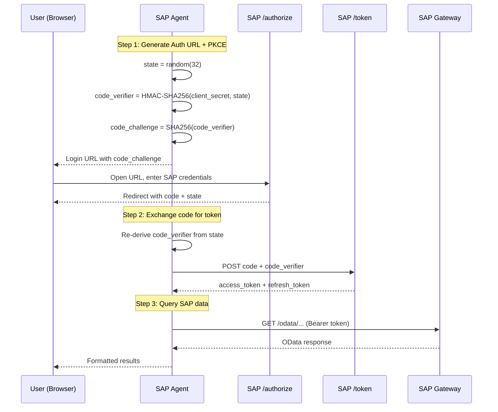
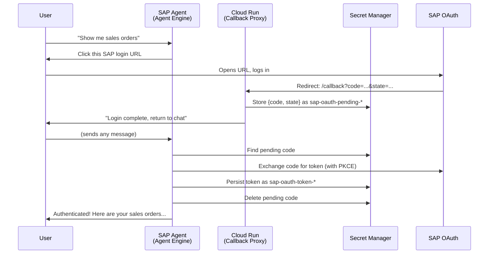

# SAP OAuth Authorization Code Setup Guide

SAP OAuth Authorization Code with PKCE enables **per-user SAP authentication**. Each user logs in with their own SAP credentials, and all OData requests execute under that user's PFCG authorization.

| Environment | Runtime | Auth Experience |
|-------------|---------|-----------------|
| [Development](#part-1-development-adk-web) | `adk web` or `run_https.py` | Browser redirect |
| [Production](#part-2-production-agent-engine) | Vertex AI Agent Engine | Cloud Run callback (auto-detect) |

---

## How It Works



### Deterministic PKCE

Standard PKCE stores `code_verifier` in memory between steps 1 and 2. In Agent Engine's serverless environment, containers restart between tool calls, losing in-memory state.

**Solution**: The `code_verifier` is derived deterministically using `HMAC-SHA256(client_secret, state)`. Since both `client_secret` and `state` are available at code exchange time, the verifier can be regenerated without session persistence.

Implementation: `SAPAuthorizationCodeStrategy._derive_code_verifier()` in `sap_agent/sap_gw_connector/core/auth.py`

---

## SAP System Configuration

These SAP transactions must be configured before either environment works.

### 1. Activate OAuth Endpoints (Transaction SICF)

Activate these ICF services:
- `/sap/bc/sec/oauth2/authorize` - Authorization endpoint
- `/sap/bc/sec/oauth2/token` - Token endpoint

### 2. Create OAuth Client (Transaction SOAUTH2)

1. Open transaction `SOAUTH2`
2. Create a new OAuth 2.0 client:
   - **OAuth 2.0 Client ID**: Choose an ID (e.g., `SAP_GENAI_CLIENT`)
   - **Grant Type**: Enable **Authorization Code Active**
   - **Redirect URIs**: Add your redirect URI (see environment-specific sections below)
   - **Scope**: Assign OData service scopes
3. Set the client authentication password (this becomes your `oauth_client_secret`)

### 3. Assign User Authorizations (Transaction PFCG)

Create/assign authorization roles that grant access to your OData services. Each user who will authenticate via the agent needs these roles.

### 4. Set Client User Password (Transaction SU01)

The OAuth client's communication user needs a password set - this password is used as `SAP_OAUTH_CLIENT_SECRET`.

---

## Part 1: Development (ADK Web)

### Environment Variables

Create `sap_agent/.env`:

```bash
SAP_HOST=<your-sap-host>
SAP_PORT=44300
SAP_CLIENT=100
SAP_AUTH_TYPE=sap_oauth
SAP_OAUTH_CLIENT_ID=<your-oauth-client-id>
SAP_OAUTH_CLIENT_SECRET=<your-oauth-client-secret>
SAP_OAUTH_TOKEN_URL=https://<sap-host>:44300/sap/bc/sec/oauth2/token?sap-client=100
SAP_OAUTH_AUTHORIZE_URL=https://<sap-host>:44300/sap/bc/sec/oauth2/authorize?sap-client=100
SAP_OAUTH_REDIRECT_URI=https://localhost:8000/dev-callback
SAP_OAUTH_SCOPE=<your-scope>
```

### HTTPS Server (Required for OAuth)

SAP OAuth requires HTTPS redirect URIs. Use the provided HTTPS dev server:

```bash
# Generate self-signed certificate
mkdir -p certs
openssl req -x509 -newkey rsa:2048 -keyout certs/key.pem -out certs/cert.pem \
  -days 365 -nodes -subj '/CN=localhost'

# Run HTTPS server
python run_https.py
# Available at https://localhost:8000
```

Register `https://localhost:8000/dev-callback` as a redirect URI in SAP Transaction SOAUTH2.

### Development Auth Flow

1. Open the ADK web UI or HTTPS server
2. Ask the agent to authenticate
3. Agent returns a SAP login URL
4. Open the URL, log in with SAP credentials
5. SAP redirects back to `localhost` with the authorization code
6. Copy the `code` and `state` parameters back to the agent (or the agent picks them up from the redirect)
7. Agent exchanges the code for a per-user SAP token

---

## Part 2: Production (Agent Engine)

In production, the **Cloud Run OAuth Callback Proxy** eliminates manual code copy-paste.

### Cloud Run Callback Proxy

The Cloud Run service (`cloud-run-oauth-callback/main.py`):
1. Receives the SAP OAuth redirect with `code` and `state`
2. Stores the code in Secret Manager (`sap-oauth-pending-*` secrets)
3. Optionally identifies the user via Google One Tap
4. Shows a success page ("return to chat")

The agent then:
1. Checks Secret Manager for pending codes
2. Exchanges the code for a SAP token
3. Persists the token in Secret Manager (`sap-oauth-token-*`) for cross-worker access
4. Cleans up the pending code secret

### Deploy Cloud Run

```bash
cd cloud-run-oauth-callback/

gcloud run deploy sap-oauth-callback \
  --source . \
  --region us-central1 \
  --allow-unauthenticated \
  --set-env-vars GOOGLE_CLOUD_PROJECT=$PROJECT_ID \
  --memory 256Mi \
  --min-instances 0 \
  --max-instances 2
```

### Configure Redirect URI

1. Get the Cloud Run URL:
   ```bash
   gcloud run services describe sap-oauth-callback \
     --region us-central1 --format "value(status.url)"
   ```
2. Register `<cloud-run-url>/callback` in SAP Transaction SOAUTH2
3. Update the `sap-credentials` secret with this URL as `oauth_redirect_uri`

### Production Environment Variables

SAP credentials are stored in Secret Manager (not environment variables). The deploy script reads from Secret Manager and sets env vars at deploy time, except `oauth_redirect_uri` which is loaded at runtime.

```bash
# Store credentials in Secret Manager
echo '{
  "auth_type": "sap_oauth",
  "host": "<your-sap-internal-ip>",
  "port": 44300,
  "client": "100",
  "oauth_client_id": "<your-oauth-client-id>",
  "oauth_client_secret": "<your-oauth-client-secret>",
  "oauth_token_url": "https://<sap-host>:44300/sap/bc/sec/oauth2/token?sap-client=100",
  "oauth_authorize_url": "https://<sap-host>:44300/sap/bc/sec/oauth2/authorize?sap-client=100",
  "oauth_redirect_uri": "https://sap-oauth-callback-<HASH>.us-central1.run.app/callback",
  "oauth_scope": "<your-scope>"
}' | gcloud secrets versions add sap-credentials --data-file=-
```

### IAM Permissions for Cloud Run + Agent Engine

| Service Account | Role | Scope | Purpose |
|----------------|------|-------|---------|
| Cloud Run default SA | `secretmanager.secrets.create`, `versions.add` | `sap-oauth-pending-*` | Store pending OAuth codes |
| Agent Engine SA | `roles/secretmanager.viewer` | Project | List secrets |
| Agent Engine SA | `roles/secretmanager.admin` | `sap-oauth-*` | Read/delete pending codes, manage tokens |

```bash
AE_SA="agent-engine-sa@${PROJECT_ID}.iam.gserviceaccount.com"

gcloud projects add-iam-policy-binding $PROJECT_ID \
  --member="serviceAccount:$AE_SA" \
  --role="roles/secretmanager.viewer"

gcloud projects add-iam-policy-binding $PROJECT_ID \
  --member="serviceAccount:$AE_SA" \
  --role="roles/secretmanager.admin" \
  --condition='expression=resource.name.startsWith("projects/'$PROJECT_ID'/secrets/sap-oauth-"),title=sap-oauth-secrets'
```

### Production Auth Flow



---

## Token Management

### Per-User Token Cache

- In-memory cache: thread-safe `Dict[str, SAPAuthenticator]`, max 1000 entries
- Expired tokens are cleaned up periodically
- Auto-refresh via `refresh_token` when access token expires

### Cross-Worker Persistence

Agent Engine runs multiple workers. Tokens are persisted to Secret Manager (`sap-oauth-token-<uid>`) so any worker can serve any user. When a worker has a cache miss, it reconstructs the authenticator from:
1. ADK session state (`sap_token_data`)
2. Secret Manager (`sap-oauth-token-<uid>`)

### User Identity Resolution

The agent identifies users via (in priority order):
1. `invocation_context.user_id` — real identity from Gemini Enterprise (the generic `default-user-id` is filtered out)
2. ADK session state `user_id` — set after successful OAuth (contains email or session-based UID)
3. Session-based UID (`session-{session_id}`) — unique per session, stable within a session
4. Last authenticated user (in-memory fallback)

For **cross-session recovery** (when Agent Engine creates a new session for follow-up questions), the agent scans Secret Manager for existing `sap-oauth-token-*` secrets to find the user's previously stored token.

---

## Troubleshooting

| Issue | Solution |
|-------|----------|
| "invalid_grant" error | Authorization code expired. Restart the login flow. |
| "invalid_client" error | Check `SAP_OAUTH_CLIENT_ID` and `SAP_OAUTH_CLIENT_SECRET` |
| Redirect URI mismatch | Must match exactly in SOAUTH2, Secret Manager, and Cloud Run |
| PKCE state lost | Agent uses deterministic PKCE - no state needed |
| Token not found after login | Check Cloud Run logs, verify Secret Manager permissions |
| SSL errors in dev | Use `SAP_VERIFY_SSL=false` for self-signed certs |

---

- [Korean Documentation (한국어 문서)](KR/AUTH_SAP_OAUTH.md)
