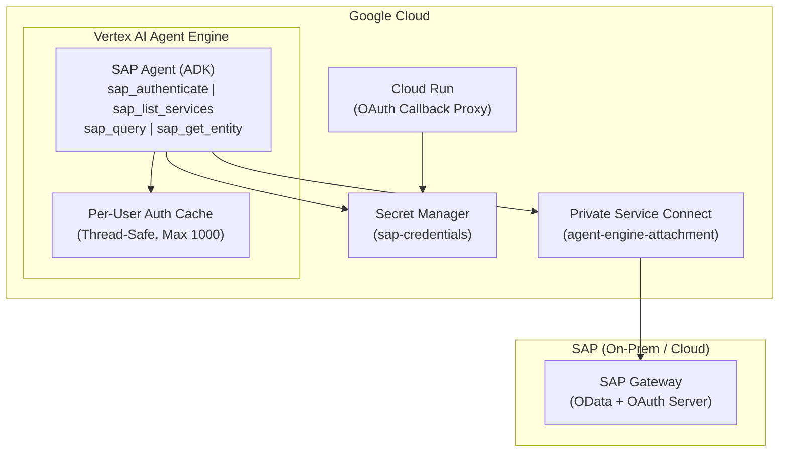
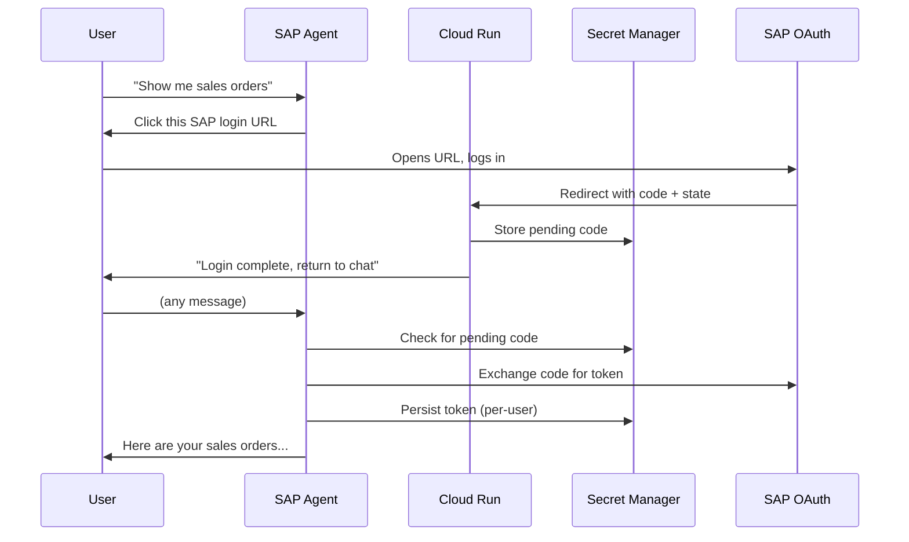

# Deployment Guide - Vertex AI Agent Engine

Step-by-step guide to deploying the SAP Agent to Google Cloud's Vertex AI Agent Engine.

---

## Architecture Overview



**Key design decisions:**
- Tools are implemented as direct Python functions (not MCP subprocess) for Agent Engine compatibility
- PKCE code verifier is derived deterministically via HMAC-SHA256 to survive container restarts
- Secret Manager is lazy-loaded to avoid import-time permission errors
- `nest_asyncio` handles event loop conflicts in Agent Engine's serverless environment

---

## Prerequisites

### GCP APIs

Enable the following APIs (automated by `setup_gcp_prerequisites.sh`):

- Vertex AI API
- Secret Manager API
- Cloud Build API
- Cloud Run API (for OAuth callback)

### Service Accounts

| Service Account | Purpose |
|----------------|---------|
| `agent-engine-sa@{PROJECT_ID}.iam.gserviceaccount.com` | Agent Engine runtime |
| `service-{PROJECT_NUMBER}@gcp-sa-aiplatform.iam.gserviceaccount.com` | AI Platform managed |
| `service-{PROJECT_NUMBER}@gcp-sa-aiplatform-re.iam.gserviceaccount.com` | Reasoning Engine managed |
| `service-{PROJECT_NUMBER}@gcp-sa-aiplatform-cc.iam.gserviceaccount.com` | Code Execution managed |

**Required IAM roles** for `agent-engine-sa`:
- `roles/serviceusage.serviceUsageConsumer`
- `roles/aiplatform.user`
- `roles/secretmanager.secretAccessor`
- `roles/secretmanager.viewer` (for listing pending OAuth secrets)
- `roles/secretmanager.admin` (conditional, scoped to `sap-oauth-*` secrets)

### SAP Prerequisites

1. **Transaction SICF**: Activate `/sap/bc/sec/oauth2/authorize` and `/sap/bc/sec/oauth2/token`
2. **Transaction SOAUTH2**: Create OAuth 2.0 client with Authorization Code grant type
3. **Transaction PFCG**: Assign OData service authorizations to end users

See [SAP OAuth Setup Guide](AUTH_SAP_OAUTH.md) for detailed instructions.

---

## Step 1: GCP Infrastructure Setup

```bash
export PROJECT_ID="<your-project-id>"
export REGION="us-central1"

# Set up APIs, service accounts, IAM roles
./scripts/setup_gcp_prerequisites.sh

# Set up Private Service Connect (if SAP is on-prem)
./scripts/setup_psc_infrastructure.sh
```

The PSC script creates:
- A PSC subnet for the network attachment
- A network attachment named `agent-engine-attachment`
- Firewall rules allowing traffic to SAP Gateway (port 44300)

---

## Step 2: Secret Manager Configuration

Create the `sap-credentials` secret with your SAP OAuth configuration:

```bash
gcloud secrets create sap-credentials --replication-policy="automatic"

echo '{
  "auth_type": "sap_oauth",
  "host": "<your-sap-internal-ip>",
  "port": 44300,
  "client": "100",
  "oauth_client_id": "<your-oauth-client-id>",
  "oauth_client_secret": "<your-oauth-client-secret>",
  "oauth_token_url": "https://<sap-host>:44300/sap/bc/sec/oauth2/token?sap-client=100",
  "oauth_authorize_url": "https://<sap-host>:44300/sap/bc/sec/oauth2/authorize?sap-client=100",
  "oauth_redirect_uri": "https://sap-oauth-callback-<HASH>.<REGION>.run.app/callback",
  "oauth_scope": "<your-oauth-scope>"
}' | gcloud secrets versions add sap-credentials --data-file=-
```

> **Note**: `oauth_redirect_uri` is intentionally excluded from deploy-time environment variables. The agent reads it from Secret Manager at runtime, allowing you to update the redirect URI without redeploying.

---

## Step 3: Deploy Cloud Run OAuth Callback

The Cloud Run callback proxy automates the SAP OAuth flow. Instead of users manually copying authorization codes, Cloud Run captures the callback and stores the code in Secret Manager for the agent to pick up automatically.

```bash
cd cloud-run-oauth-callback/

gcloud run deploy sap-oauth-callback \
  --source . \
  --region $REGION \
  --allow-unauthenticated \
  --set-env-vars GOOGLE_CLOUD_PROJECT=$PROJECT_ID \
  --memory 256Mi \
  --min-instances 0 \
  --max-instances 2

# Get the deployed URL
gcloud run services describe sap-oauth-callback \
  --region $REGION \
  --format "value(status.url)"
# Output: https://sap-oauth-callback-<HASH>.<REGION>.run.app
```

**After deploying Cloud Run:**
1. Register `https://sap-oauth-callback-<HASH>.<REGION>.run.app/callback` as the redirect URI in SAP Transaction SOAUTH2
2. Update the `sap-credentials` secret with this URL as `oauth_redirect_uri`

### Cloud Run IAM

```bash
AE_SA="agent-engine-sa@${PROJECT_ID}.iam.gserviceaccount.com"

# List secrets (to find pending OAuth codes)
gcloud projects add-iam-policy-binding $PROJECT_ID \
  --member="serviceAccount:$AE_SA" \
  --role="roles/secretmanager.viewer"

# Read/delete pending codes and manage per-user tokens
gcloud projects add-iam-policy-binding $PROJECT_ID \
  --member="serviceAccount:$AE_SA" \
  --role="roles/secretmanager.admin" \
  --condition='expression=resource.name.startsWith("projects/'$PROJECT_ID'/secrets/sap-oauth-"),title=sap-oauth-secrets'
```

---

## Step 4: Deploy Agent to Agent Engine

```bash
cd /path/to/sap-adk-agent

# Authenticate
gcloud auth application-default login
gcloud config set project $PROJECT_ID

# New deployment
python scripts/deploy_agent_engine.py --project $PROJECT_ID

# Update existing deployment
python scripts/deploy_agent_engine.py --project $PROJECT_ID \
  --update projects/<NUM>/locations/$REGION/reasoningEngines/<ENGINE_ID>

# Custom region
python scripts/deploy_agent_engine.py --project $PROJECT_ID --region asia-northeast3
```

### What the Deploy Script Does

1. Loads SAP credentials from Secret Manager
2. Initializes Vertex AI SDK with project/location/staging bucket
3. Wraps the agent with `AdkApp` for Agent Engine compatibility
4. Deploys with:
   - PSC network attachment (`agent-engine-attachment`)
   - SAP credentials as environment variables (except `oauth_redirect_uri`)
   - Service account: `agent-engine-sa@{PROJECT_ID}.iam.gserviceaccount.com`
   - Resource limits: 8 CPU, 16Gi memory
   - OpenTelemetry tracing enabled

---

## Step 5: Verify Deployment

```bash
# List deployed agents
gcloud ai reasoning-engines list --region=$REGION

# View agent details
gcloud ai reasoning-engines describe <ENGINE_ID> --region=$REGION
```

### Test with Python

```python
from vertexai import agent_engines

agent = agent_engines.get(
    "projects/<project-number>/locations/<region>/reasoningEngines/<engine-id>"
)

session = agent.create_session()

# Test service listing
response = session.send_message("List available SAP services")
print(response.text)

# Test authentication (will return login URL)
response = session.send_message("Authenticate with SAP")
print(response.text)
```

---

## Authentication Flow (Production)



---

## Troubleshooting

### Authentication Failures

```bash
# Check credentials in Secret Manager
gcloud secrets versions access latest --secret=sap-credentials

# Check agent logs
gcloud logging read "resource.type=aiplatform.googleapis.com/ReasoningEngine" \
  --limit=50 --format=json
```

### Network Issues

- Verify SAP internal IP is used (not external hostname)
- Check network attachment exists: `gcloud compute network-attachments list`
- Verify firewall allows port 44300

### PKCE State Lost

The agent uses deterministic PKCE (`_derive_code_verifier` in `auth.py`), deriving `code_verifier` from `HMAC-SHA256(client_secret, state)`. This survives container restarts without session persistence.

### Missing redirect_uri

The agent loads `oauth_redirect_uri` from Secret Manager at runtime (`_load_runtime_secrets` in `agent.py`). Ensure the `sap-credentials` secret contains this field.

### Cleanup

```bash
# Remove old deployments
python scripts/cleanup_agent_engines.py
```

---

## Resource Summary

| Item | Value |
|------|-------|
| Default Region | us-central1 |
| Service Account | agent-engine-sa@{PROJECT_ID}.iam.gserviceaccount.com |
| Network Attachment | agent-engine-attachment |
| Secret Name | sap-credentials |
| Staging Bucket | gs://{PROJECT_ID}_cloudbuild |
| Resource Limits | 8 CPU, 16Gi memory |

---

- [Korean Documentation (한국어 문서)](KR/DEPLOYMENT_GUIDE.md)
