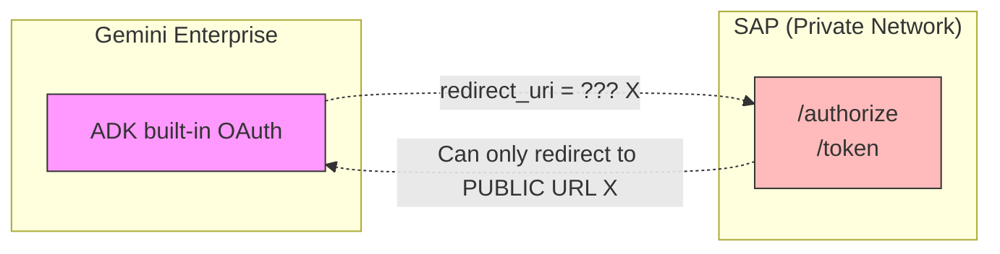
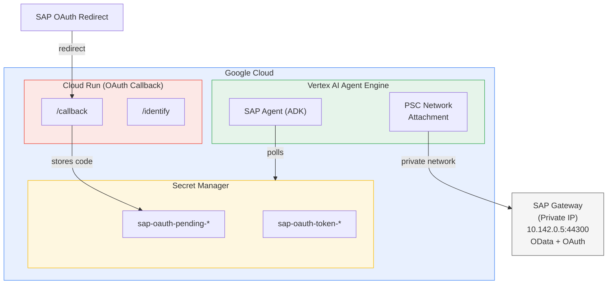
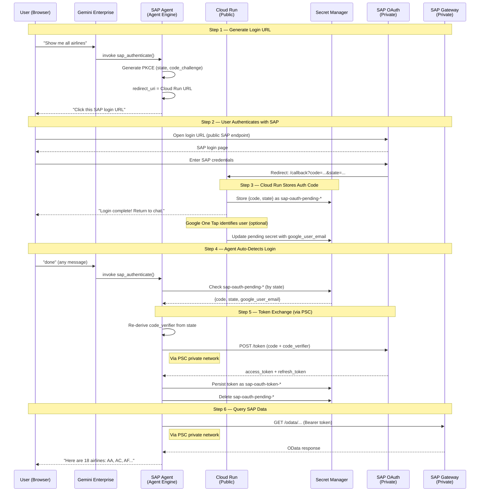
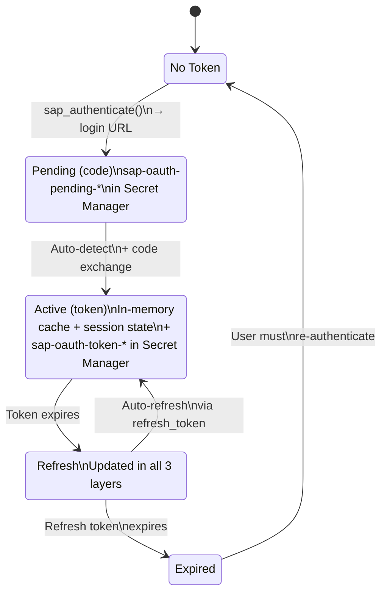

# Gemini Enterprise — SAP OAuth 2.0 Integration

This document explains why and how this project implements a **custom OAuth 2.0 flow** for SAP authentication in Gemini Enterprise, instead of using ADK's built-in OAuth support.

---

## The Problem

Connecting Gemini Enterprise to an on-premise SAP system requires solving two conflicting constraints:

| Constraint | Detail |
|---|---|
| **SAP is on a private network** | SAP Gateway is accessible only via private IP (e.g., `10.142.0.5:44300`), not exposed to the public internet |
| **Gemini Enterprise OAuth requires public endpoints** | ADK's built-in `get_auth_response()` / `request_credential()` can only redirect to public domains — it cannot reach private SAP OAuth endpoints |

This means:
- **Data access** works: Agent Engine → PSC (Private Service Connect) → SAP Gateway (private IP)
- **OAuth redirect** does NOT work: SAP OAuth server → ??? → Agent Engine has no public callback endpoint



> **No public endpoint for Agent Engine** — redirect fails in both directions.

### Why ADK's Built-in OAuth Doesn't Work

The ADK `AuthConfig` is defined in `sap_agent/sap_auth_config.py`:

```python
auth_config = AuthConfig(
    auth_type=AuthType.OAUTH2,
    oauth2=OAuth2Auth(
        ...
        flows=OAuthFlows(
            authorization_code=OAuthFlowAuthorizationCode(
                authorization_url=os.getenv("SAP_OAUTH_AUTHORIZE_URL"),
                token_url=os.getenv("SAP_OAUTH_TOKEN_URL"),
            )
        ),
    ),
)
```

When the agent calls `tool_context.get_auth_response(auth_config)`, Gemini Enterprise attempts to handle the OAuth flow internally. However:

1. **Gemini Enterprise cannot reach `SAP_OAUTH_TOKEN_URL`** — it's a private IP
2. **SAP cannot redirect back** — Agent Engine has no public callback URL
3. **Result**: `get_auth_response()` always returns `None`

This is confirmed in `sap_agent/agent.py`:

```python
# Gemini Enterprise does not support third-party OAuth consent
# via adk_request_credential, so we fall through to the existing
# custom OAuth flow that generates a login URL for the user.
logger.info("sap_authenticate: ADK get_auth_response returned None, "
            "falling through to custom OAuth flow")
```

---

## The Solution: Cloud Run OAuth Callback Proxy

A **Cloud Run service** acts as the public-facing OAuth callback endpoint, bridging the gap between SAP's public OAuth redirect and Agent Engine's private runtime.

### Architecture



### Two Separate Network Paths

| Path | Purpose | Network | Direction |
|------|---------|---------|-----------|
| **Data Path** | OData queries | Private (PSC) | Agent Engine → SAP |
| **Auth Path** | OAuth callback | Public (Cloud Run) | SAP → Cloud Run → Secret Manager → Agent Engine |

This separation is the key insight: **data flows over private network, but OAuth redirects flow over public internet through a proxy**.

---

## Complete OAuth Flow



---

## Key Technical Decisions

### 1. Deterministic PKCE Code Verifier

Standard PKCE generates a random `code_verifier` and stores it in memory between Step 1 (URL generation) and Step 5 (token exchange). In Agent Engine's serverless environment, the container may restart or the request may be routed to a different worker between these steps, losing the in-memory state.

**Solution** (`sap_gw_connector/core/auth.py`):

```python
def _derive_code_verifier(self, state: str) -> str:
    """Derive PKCE code_verifier deterministically from state + client_secret.

    HMAC-SHA256(client_secret, state) → code_verifier
    """
    secret_key = (self.config.oauth_client_secret or "default").encode()
    verifier_bytes = hmac.new(
        secret_key, state.encode(), hashlib.sha256
    ).digest()
    return base64.urlsafe_b64encode(verifier_bytes).rstrip(b"=").decode()
```

Since both `client_secret` (env var) and `state` (returned in the callback) are always available, the verifier can be regenerated on any worker at any time.

### 2. Session-Based User Identity

Gemini Enterprise sends `default-user-id` for all users when real identity is unavailable. Using this as a shared key would be a security issue — multiple users' tokens could collide.

**Solution** (`sap_agent/agent.py`):

```python
def _get_uid_from_context(tool_context):
    # Priority 1: Real user identity (skip "default-user-id")
    if ctx_uid and ctx_uid != "default-user-id":
        return ctx_uid

    # Priority 2: Session state (set after OAuth)
    state_uid = tool_context.state.get("user_id")  # e.g., "admin@user.com"

    # Priority 3: Session-based UID (unique per session)
    return f"session-{session_id}"  # e.g., "session-50a0d951-ccce-..."
```

`default-user-id` never enters the system. Each session gets a unique identity, upgraded to the real email after OAuth completes.

### 3. Three-Tier Pending Code Detection

When the user says "done" after logging in, the agent must find the pending authorization code. This is challenging in a serverless environment:

| Tier | Method | When Used |
|------|--------|-----------|
| **Fast path 1** | Direct secret lookup by known `state` (from in-memory cache) | Same worker, same session |
| **Fast path 2** | Direct secret lookup by `state` from session state (`sap_oauth_state`) | Cross-worker, same session |
| **Slow path** | Scan all `sap-oauth-pending-*` secrets | Container restart, new session |

```python
# Fast path 1: in-memory state
pending = _check_pending_oauth_code(strategy._last_auth_info["state"])

# Fast path 2: session state (survives cross-worker)
saved_state = tool_context.state.get("sap_oauth_state")
pending = _check_pending_oauth_code(saved_state)

# Slow path: scan all pending secrets
pending = _find_any_pending_oauth_code()
```

### 4. Cross-Session Token Recovery

Agent Engine may create a new session for follow-up questions. The new session has a different `session_id`, so the token stored under the old session UID is not directly found.

**Solution**: Scan `sap-oauth-token-*` secrets in Secret Manager as a last-resort fallback:

```python
def _find_any_token_secret_uid():
    """Scan for any existing per-user token secret."""
    for secret in client.list_secrets(...):
        if name.startswith("sap-oauth-token-"):
            data = load_secret_version(secret)
            return data.get("user_id")  # e.g., "admin@user.com"
```

### 5. Google One Tap User Identification

After SAP login, the Cloud Run callback page shows a Google One Tap prompt to identify the user's Google account. This links the SAP OAuth code to the correct Google user:

```
Cloud Run /callback → success page
    → Google One Tap → user's Google email
    → POST /identify → update pending secret with google_user_email
    → Agent reads email → uses as user_id for token storage
```

This is optional — the auth flow works without it, but user identification enables proper per-user token management.

---

## Infrastructure Requirements

### Private Service Connect (PSC)

PSC enables Agent Engine to reach SAP's private IP:

```bash
# PSC subnet for Agent Engine containers
gcloud compute networks subnets create psc-subnet \
    --range=192.168.10.0/28 \
    --purpose=PRIVATE_SERVICE_CONNECT

# Network attachment connecting Agent Engine to VPC
gcloud compute network-attachments create agent-engine-attachment \
    --subnets=psc-subnet

# Firewall: allow Agent Engine → SAP
gcloud compute firewall-rules create allow-agent-engine-to-sap \
    --source-ranges="192.168.10.0/28" \
    --destination-ranges="10.142.0.5/32" \
    --rules=tcp:44300
```

### Cloud Run OAuth Callback

```bash
cd cloud-run-oauth-callback/
gcloud run deploy sap-oauth-callback \
    --source . \
    --allow-unauthenticated \
    --set-env-vars GOOGLE_CLOUD_PROJECT=$PROJECT_ID
```

The deployed URL (e.g., `https://sap-oauth-callback-HASH.us-central1.run.app/callback`) must be registered as the redirect URI in SAP Transaction SOAUTH2.

### Secret Manager

| Secret Pattern | Purpose | Created By | Read By |
|---|---|---|---|
| `sap-credentials` | SAP OAuth config (client_id, secret, URLs) | Admin | Agent Engine |
| `sap-oauth-pending-*` | Temporary auth codes from callback | Cloud Run | Agent Engine |
| `sap-oauth-token-*` | Per-user access/refresh tokens | Agent Engine | Agent Engine |

### IAM Permissions

| Service Account | Role | Scope |
|---|---|---|
| Cloud Run default SA | `secretmanager.admin` | `sap-oauth-pending-*` |
| Agent Engine SA (`agent-engine-sa`) | `secretmanager.viewer` | Project (list secrets) |
| Agent Engine SA | `secretmanager.admin` | `sap-oauth-*` (read/delete pending, manage tokens) |

---

## Token Lifecycle



### Token Persistence Layers

| Layer | Scope | Survives |
|---|---|---|
| **In-memory cache** | Per-worker process | Within same worker |
| **ADK session state** | Per-session | Cross-worker (same session) |
| **Secret Manager** | Per-user | Cross-session, cross-worker, container restart |

---

## Comparison: Built-in ADK OAuth vs Custom Flow

| Aspect | ADK Built-in OAuth | Custom Flow (This Project) |
|---|---|---|
| **SAP on private IP** | Not supported | Supported via PSC |
| **Callback endpoint** | Managed by Gemini | Cloud Run (public) |
| **Token storage** | ADK credential store | Secret Manager |
| **PKCE** | Standard (in-memory) | Deterministic (HMAC) |
| **User identity** | Gemini user_id | Session-based UID + Google One Tap |
| **Cross-worker** | ADK session | Secret Manager + session state |
| **Configuration** | AuthConfig only | AuthConfig + Cloud Run + PSC + Secret Manager |

### When Can You Use Built-in ADK OAuth Instead?

If **all** of these conditions are met:
1. SAP OAuth endpoints are accessible via **public domain** (not private IP)
2. Gemini Enterprise supports **third-party OAuth consent** for your SAP provider
3. You don't need **PSC** for data access (SAP is cloud-hosted with public endpoints)

In that case, the `AuthConfig` in `sap_auth_config.py` would work directly, and Cloud Run + custom flow would not be needed.

---

## Related Documentation

- [SAP OAuth Setup Guide](AUTH_SAP_OAUTH.md) — SAP transaction configuration (SICF, SOAUTH2, PFCG)
- [Cloud Run OAuth Callback](CLOUD_RUN_OAUTH_CALLBACK.md) — Callback service details
- [Deployment Guide](DEPLOYMENT_GUIDE.md) — Full deployment steps including PSC setup
- [Architecture](ARCHITECTURE.md) — Overall system architecture

---

- [Korean Documentation (한국어 문서)](KR/GEMINI_ENTERPRISE_SAP_OAUTH.md)
