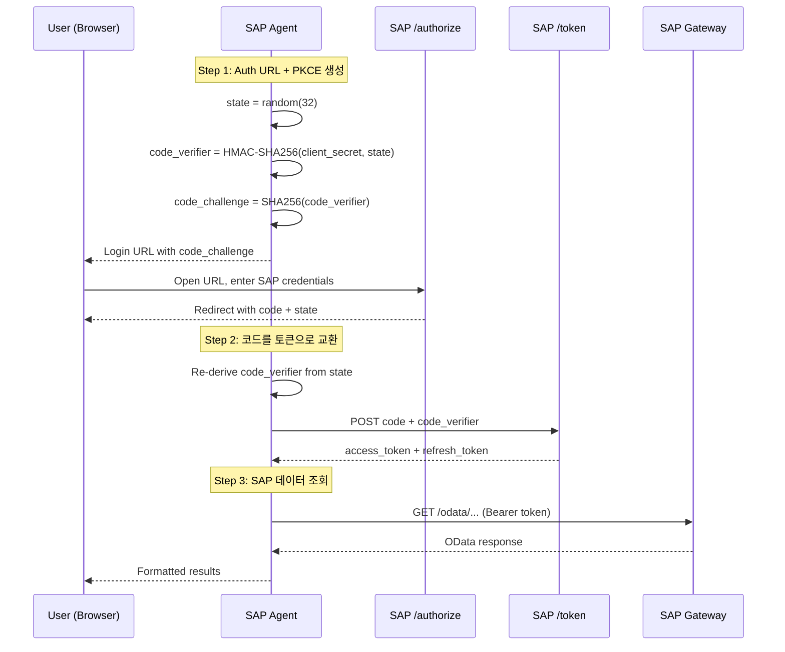
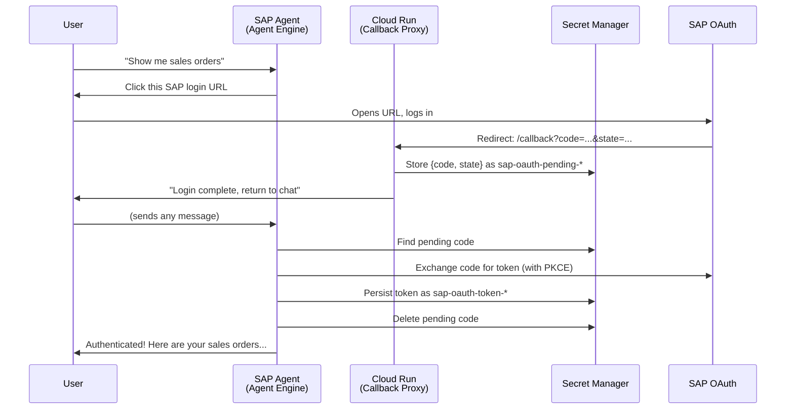

# SAP OAuth Authorization Code 설정 가이드

SAP OAuth Authorization Code with PKCE는 **사용자별 SAP 인증**을 지원합니다. 각 사용자가 자신의 SAP 자격증명으로 로그인하며, 모든 OData 요청이 해당 사용자의 PFCG 권한으로 실행됩니다.

| 환경 | 런타임 | 인증 UX |
|------|--------|---------|
| [개발 환경](#part-1-개발-환경-adk-web) | `adk web` 또는 `run_https.py` | 브라우저 리다이렉트 |
| [프로덕션 환경](#part-2-프로덕션-환경-agent-engine) | Vertex AI Agent Engine | Cloud Run 콜백 (자동 감지) |

---

## 동작 원리



### 결정적 PKCE

표준 PKCE는 Step 1과 Step 2 사이에 `code_verifier`를 메모리에 저장합니다. Agent Engine의 서버리스 환경에서는 컨테이너가 도구 호출 사이에 재시작되어 인메모리 상태가 유실됩니다.

**해결 방법**: `code_verifier`를 `HMAC-SHA256(client_secret, state)`로 결정적으로 유도합니다. `client_secret`과 `state` 모두 코드 교환 시점에 사용 가능하므로, 세션 영속성 없이도 verifier를 재생성할 수 있습니다.

구현: `sap_agent/sap_gw_connector/core/auth.py`의 `SAPAuthorizationCodeStrategy._derive_code_verifier()`

---

## SAP 시스템 설정

개발/프로덕션 환경 모두에서 다음 SAP 트랜잭션을 먼저 설정해야 합니다.

### 1. OAuth 엔드포인트 활성화 (트랜잭션 SICF)

다음 ICF 서비스를 활성화합니다:
- `/sap/bc/sec/oauth2/authorize` - 인가 엔드포인트
- `/sap/bc/sec/oauth2/token` - 토큰 엔드포인트

### 2. OAuth 클라이언트 생성 (트랜잭션 SOAUTH2)

1. 트랜잭션 `SOAUTH2`를 실행합니다
2. 새 OAuth 2.0 클라이언트를 생성합니다:
   - **OAuth 2.0 Client ID**: ID 선택 (예: `SAP_GENAI_CLIENT`)
   - **Grant Type**: **Authorization Code Active** 활성화
   - **Redirect URIs**: 리다이렉트 URI 추가 (환경별 섹션 참조)
   - **Scope**: OData 서비스 스코프 할당
3. 클라이언트 인증 비밀번호를 설정합니다 (이것이 `oauth_client_secret`이 됩니다)

### 3. 사용자 권한 할당 (트랜잭션 PFCG)

OData 서비스에 대한 접근 권한을 부여하는 권한 역할을 생성/할당합니다. Agent를 통해 인증할 각 사용자에게 이 역할이 필요합니다.

### 4. 클라이언트 사용자 비밀번호 설정 (트랜잭션 SU01)

OAuth 클라이언트의 통신 사용자에게 비밀번호를 설정해야 합니다. 이 비밀번호가 `SAP_OAUTH_CLIENT_SECRET`으로 사용됩니다.

---

## Part 1: 개발 환경 (ADK Web)

### 환경 변수

`sap_agent/.env` 파일을 생성합니다:

```bash
SAP_HOST=<your-sap-host>
SAP_PORT=44300
SAP_CLIENT=100
SAP_AUTH_TYPE=sap_oauth
SAP_OAUTH_CLIENT_ID=<your-oauth-client-id>
SAP_OAUTH_CLIENT_SECRET=<your-oauth-client-secret>
SAP_OAUTH_TOKEN_URL=https://<sap-host>:44300/sap/bc/sec/oauth2/token?sap-client=100
SAP_OAUTH_AUTHORIZE_URL=https://<sap-host>:44300/sap/bc/sec/oauth2/authorize?sap-client=100
SAP_OAUTH_REDIRECT_URI=https://localhost:8000/dev-callback
SAP_OAUTH_SCOPE=<your-scope>
```

### HTTPS 서버 (OAuth에 필수)

SAP OAuth는 HTTPS 리다이렉트 URI를 요구합니다. 제공된 HTTPS 개발 서버를 사용하세요:

```bash
# 자체 서명 인증서 생성
mkdir -p certs
openssl req -x509 -newkey rsa:2048 -keyout certs/key.pem -out certs/cert.pem \
  -days 365 -nodes -subj '/CN=localhost'

# HTTPS 서버 실행
python run_https.py
# https://localhost:8000에서 접속 가능
```

SAP 트랜잭션 SOAUTH2에 `https://localhost:8000/dev-callback`을 리다이렉트 URI로 등록합니다.

### 개발 환경 인증 흐름

1. ADK Web UI 또는 HTTPS 서버를 실행합니다
2. Agent에게 인증을 요청합니다
3. Agent가 SAP 로그인 URL을 반환합니다
4. URL을 열고 SAP 자격증명으로 로그인합니다
5. SAP이 인가 코드와 함께 `localhost`로 리다이렉트합니다
6. `code`와 `state` 파라미터를 Agent에게 전달합니다 (또는 Agent가 리다이렉트에서 자동으로 가져옵니다)
7. Agent가 코드를 사용자별 SAP 토큰으로 교환합니다

---

## Part 2: 프로덕션 환경 (Agent Engine)

프로덕션에서는 **Cloud Run OAuth Callback Proxy**가 수동 코드 복사를 제거합니다.

### Cloud Run 콜백 프록시

Cloud Run 서비스(`cloud-run-oauth-callback/main.py`):
1. `code`와 `state`가 포함된 SAP OAuth 리다이렉트를 수신합니다
2. Secret Manager에 코드를 저장합니다 (`sap-oauth-pending-*` 시크릿)
3. 선택적으로 Google One Tap을 통해 사용자를 식별합니다
4. 성공 페이지를 표시합니다 ("채팅으로 돌아가세요")

이후 Agent가:
1. Secret Manager에서 pending 코드를 확인합니다
2. 코드를 SAP 토큰으로 교환합니다
3. 크로스 워커 접근을 위해 Secret Manager에 토큰을 영속화합니다 (`sap-oauth-token-*`)
4. pending 코드 시크릿을 정리합니다

### Cloud Run 배포

```bash
cd cloud-run-oauth-callback/

gcloud run deploy sap-oauth-callback \
  --source . \
  --region us-central1 \
  --allow-unauthenticated \
  --set-env-vars GOOGLE_CLOUD_PROJECT=$PROJECT_ID \
  --memory 256Mi \
  --min-instances 0 \
  --max-instances 2
```

### 리다이렉트 URI 설정

1. Cloud Run URL을 확인합니다:
   ```bash
   gcloud run services describe sap-oauth-callback \
     --region us-central1 --format "value(status.url)"
   ```
2. `<cloud-run-url>/callback`을 SAP 트랜잭션 SOAUTH2에 등록합니다
3. `sap-credentials` 시크릿의 `oauth_redirect_uri`를 이 URL로 업데이트합니다

### 프로덕션 환경 변수

SAP 자격증명은 Secret Manager에 저장됩니다 (환경 변수가 아닌). 배포 스크립트가 Secret Manager에서 읽어 배포 시 env vars로 설정하며, `oauth_redirect_uri`는 런타임에 로드됩니다.

```bash
# Secret Manager에 자격증명 저장
echo '{
  "auth_type": "sap_oauth",
  "host": "<your-sap-internal-ip>",
  "port": 44300,
  "client": "100",
  "oauth_client_id": "<your-oauth-client-id>",
  "oauth_client_secret": "<your-oauth-client-secret>",
  "oauth_token_url": "https://<sap-host>:44300/sap/bc/sec/oauth2/token?sap-client=100",
  "oauth_authorize_url": "https://<sap-host>:44300/sap/bc/sec/oauth2/authorize?sap-client=100",
  "oauth_redirect_uri": "https://sap-oauth-callback-<HASH>.us-central1.run.app/callback",
  "oauth_scope": "<your-scope>"
}' | gcloud secrets versions add sap-credentials --data-file=-
```

### Cloud Run + Agent Engine IAM 권한

| 서비스 계정 | 역할 | 범위 | 용도 |
|-------------|------|------|------|
| Cloud Run 기본 SA | `secretmanager.secrets.create`, `versions.add` | `sap-oauth-pending-*` | Pending OAuth 코드 저장 |
| Agent Engine SA | `roles/secretmanager.viewer` | 프로젝트 | 시크릿 목록 조회 |
| Agent Engine SA | `roles/secretmanager.admin` | `sap-oauth-*` | pending 코드 읽기/삭제, 토큰 관리 |

```bash
AE_SA="agent-engine-sa@${PROJECT_ID}.iam.gserviceaccount.com"

gcloud projects add-iam-policy-binding $PROJECT_ID \
  --member="serviceAccount:$AE_SA" \
  --role="roles/secretmanager.viewer"

gcloud projects add-iam-policy-binding $PROJECT_ID \
  --member="serviceAccount:$AE_SA" \
  --role="roles/secretmanager.admin" \
  --condition='expression=resource.name.startsWith("projects/'$PROJECT_ID'/secrets/sap-oauth-"),title=sap-oauth-secrets'
```

### 프로덕션 인증 흐름



---

## 토큰 관리

### 사용자별 토큰 캐시

- 인메모리 캐시: thread-safe `Dict[str, SAPAuthenticator]`, 최대 1000개 항목
- 만료된 토큰은 주기적으로 정리
- access token 만료 시 `refresh_token`으로 자동 갱신

### 크로스 워커 영속성

Agent Engine은 여러 워커를 실행합니다. 토큰은 Secret Manager(`sap-oauth-token-<uid>`)에 영속화되어 어떤 워커든 모든 사용자를 처리할 수 있습니다. 워커에서 캐시 미스가 발생하면 다음에서 authenticator를 복원합니다:
1. ADK 세션 상태 (`sap_token_data`)
2. Secret Manager (`sap-oauth-token-<uid>`)

### 사용자 식별 방식

Agent는 다음 우선순위로 사용자를 식별합니다:
1. `invocation_context.user_id` — Gemini Enterprise의 실제 사용자 ID (일반적인 `default-user-id`는 필터링됨)
2. ADK 세션 상태의 `user_id` — OAuth 성공 후 설정 (이메일 또는 세션 기반 UID)
3. 세션 기반 UID (`session-{session_id}`) — 세션별 고유값, 세션 내에서 안정적
4. 마지막으로 인증된 사용자 (인메모리 폴백)

**세션 간 복구**: Agent Engine이 후속 질문에 대해 새 세션을 생성하는 경우, Agent는 Secret Manager에서 기존 `sap-oauth-token-*` 시크릿을 스캔하여 이전에 저장된 토큰을 찾습니다.

---

## 트러블슈팅

| 문제 | 해결 방법 |
|------|----------|
| "invalid_grant" 오류 | 인가 코드가 만료됨. 로그인 흐름을 다시 시작하세요. |
| "invalid_client" 오류 | `SAP_OAUTH_CLIENT_ID`와 `SAP_OAUTH_CLIENT_SECRET` 확인 |
| 리다이렉트 URI 불일치 | SOAUTH2, Secret Manager, Cloud Run에서 정확히 일치해야 합니다 |
| PKCE 상태 소실 | Agent가 결정적 PKCE를 사용합니다 — 상태 저장이 필요 없습니다 |
| 로그인 후 토큰을 찾을 수 없음 | Cloud Run 로그를 확인하고, Secret Manager 권한을 검증하세요 |
| 개발 환경 SSL 오류 | 자체 서명 인증서에 `SAP_VERIFY_SSL=false` 사용 |

---

- [English Documentation](../AUTH_SAP_OAUTH.md)
