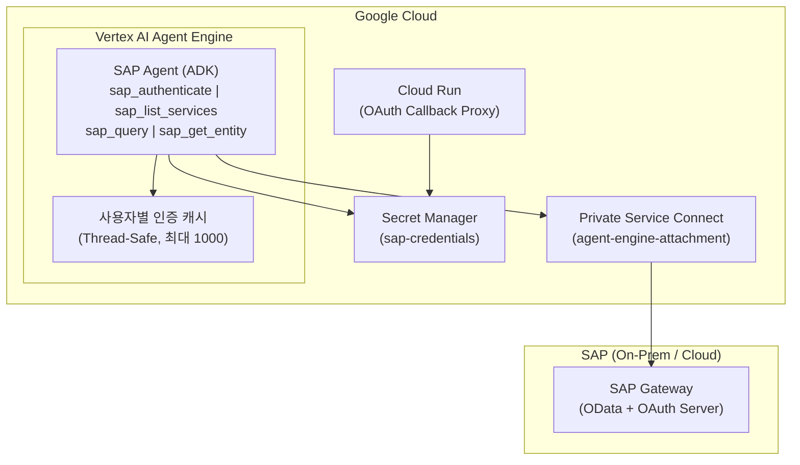
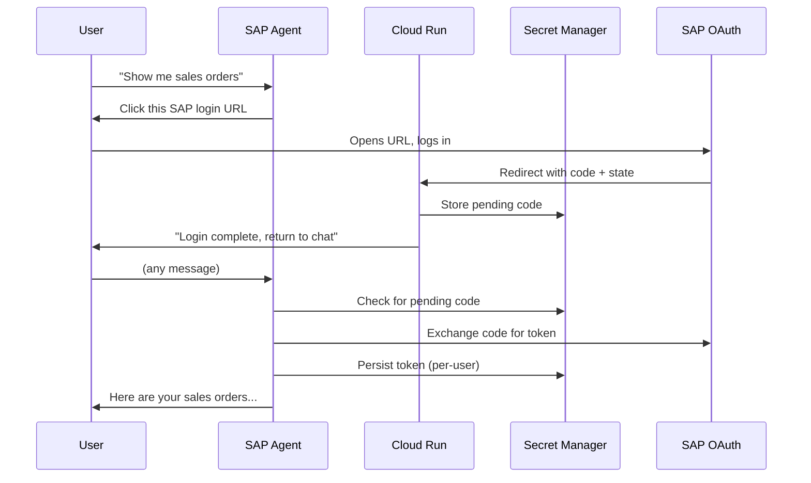

# 배포 가이드 - Vertex AI Agent Engine

SAP Agent를 Google Cloud의 Vertex AI Agent Engine에 배포하기 위한 단계별 가이드입니다.

---

## 아키텍처 개요



**핵심 설계 결정:**
- Agent Engine 호환성을 위해 도구를 직접 Python 함수로 구현 (MCP subprocess 방식이 아닌)
- 컨테이너 재시작에도 유지되도록 PKCE code verifier를 HMAC-SHA256으로 결정적 유도
- import 시점 권한 오류를 방지하기 위해 Secret Manager를 지연 로딩
- Agent Engine의 서버리스 환경에서 이벤트 루프 충돌을 처리하기 위해 `nest_asyncio` 사용

---

## 사전 요구사항

### GCP API

다음 API를 활성화합니다 (`setup_gcp_prerequisites.sh`로 자동화 가능):

- Vertex AI API
- Secret Manager API
- Cloud Build API
- Cloud Run API (OAuth 콜백용)

### 서비스 계정

| 서비스 계정 | 용도 |
|-------------|------|
| `agent-engine-sa@{PROJECT_ID}.iam.gserviceaccount.com` | Agent Engine 런타임 |
| `service-{PROJECT_NUMBER}@gcp-sa-aiplatform.iam.gserviceaccount.com` | AI Platform 관리 |
| `service-{PROJECT_NUMBER}@gcp-sa-aiplatform-re.iam.gserviceaccount.com` | Reasoning Engine 관리 |
| `service-{PROJECT_NUMBER}@gcp-sa-aiplatform-cc.iam.gserviceaccount.com` | Code Execution 관리 |

**`agent-engine-sa`에 필요한 IAM 역할:**
- `roles/serviceusage.serviceUsageConsumer`
- `roles/aiplatform.user`
- `roles/secretmanager.secretAccessor`
- `roles/secretmanager.viewer` (pending OAuth 시크릿 목록 조회용)
- `roles/secretmanager.admin` (조건부, `sap-oauth-*` 시크릿 범위)

### SAP 사전 요구사항

1. **트랜잭션 SICF**: `/sap/bc/sec/oauth2/authorize` 및 `/sap/bc/sec/oauth2/token` 활성화
2. **트랜잭션 SOAUTH2**: Authorization Code 부여 유형으로 OAuth 2.0 클라이언트 생성
3. **트랜잭션 PFCG**: 최종 사용자에게 OData 서비스 권한 할당

자세한 내용은 [SAP OAuth 설정 가이드](AUTH_SAP_OAUTH.md)를 참조하세요.

---

## Step 1: GCP 인프라 설정

```bash
export PROJECT_ID="<your-project-id>"
export REGION="us-central1"

# API, 서비스 계정, IAM 역할 설정
./scripts/setup_gcp_prerequisites.sh

# Private Service Connect 설정 (SAP가 온프레미스인 경우)
./scripts/setup_psc_infrastructure.sh
```

PSC 스크립트가 생성하는 항목:
- Network attachment용 PSC 서브넷
- `agent-engine-attachment`라는 이름의 Network attachment
- SAP Gateway(포트 44300)로의 트래픽을 허용하는 방화벽 규칙

---

## Step 2: Secret Manager 설정

SAP OAuth 설정으로 `sap-credentials` 시크릿을 생성합니다:

```bash
gcloud secrets create sap-credentials --replication-policy="automatic"

echo '{
  "auth_type": "sap_oauth",
  "host": "<your-sap-internal-ip>",
  "port": 44300,
  "client": "100",
  "oauth_client_id": "<your-oauth-client-id>",
  "oauth_client_secret": "<your-oauth-client-secret>",
  "oauth_token_url": "https://<sap-host>:44300/sap/bc/sec/oauth2/token?sap-client=100",
  "oauth_authorize_url": "https://<sap-host>:44300/sap/bc/sec/oauth2/authorize?sap-client=100",
  "oauth_redirect_uri": "https://sap-oauth-callback-<HASH>.<REGION>.run.app/callback",
  "oauth_scope": "<your-oauth-scope>"
}' | gcloud secrets versions add sap-credentials --data-file=-
```

> **참고**: `oauth_redirect_uri`는 배포 시점 환경 변수에서 의도적으로 제외됩니다. Agent가 런타임에 Secret Manager에서 읽으므로, 재배포 없이 리다이렉트 URI를 변경할 수 있습니다.

---

## Step 3: Cloud Run OAuth 콜백 배포

Cloud Run 콜백 프록시는 SAP OAuth 흐름을 자동화합니다. 사용자가 인가 코드를 수동으로 복사하는 대신, Cloud Run이 콜백을 수신하여 Agent가 자동으로 감지할 수 있도록 Secret Manager에 코드를 저장합니다.

```bash
cd cloud-run-oauth-callback/

gcloud run deploy sap-oauth-callback \
  --source . \
  --region $REGION \
  --allow-unauthenticated \
  --set-env-vars GOOGLE_CLOUD_PROJECT=$PROJECT_ID \
  --memory 256Mi \
  --min-instances 0 \
  --max-instances 2

# 배포된 URL 확인
gcloud run services describe sap-oauth-callback \
  --region $REGION \
  --format "value(status.url)"
# 출력: https://sap-oauth-callback-<HASH>.<REGION>.run.app
```

**Cloud Run 배포 후:**
1. `https://sap-oauth-callback-<HASH>.<REGION>.run.app/callback`을 SAP 트랜잭션 SOAUTH2에 리다이렉트 URI로 등록
2. `sap-credentials` 시크릿의 `oauth_redirect_uri`를 이 URL로 업데이트

### Cloud Run IAM

```bash
AE_SA="agent-engine-sa@${PROJECT_ID}.iam.gserviceaccount.com"

# 시크릿 목록 조회 (pending OAuth 코드 검색용)
gcloud projects add-iam-policy-binding $PROJECT_ID \
  --member="serviceAccount:$AE_SA" \
  --role="roles/secretmanager.viewer"

# pending 코드 읽기/삭제 및 사용자별 토큰 관리
gcloud projects add-iam-policy-binding $PROJECT_ID \
  --member="serviceAccount:$AE_SA" \
  --role="roles/secretmanager.admin" \
  --condition='expression=resource.name.startsWith("projects/'$PROJECT_ID'/secrets/sap-oauth-"),title=sap-oauth-secrets'
```

---

## Step 4: Agent Engine에 Agent 배포

```bash
cd /path/to/sap-adk-agent

# 인증
gcloud auth application-default login
gcloud config set project $PROJECT_ID

# 새 배포
python scripts/deploy_agent_engine.py --project $PROJECT_ID

# 기존 배포 업데이트
python scripts/deploy_agent_engine.py --project $PROJECT_ID \
  --update projects/<NUM>/locations/$REGION/reasoningEngines/<ENGINE_ID>

# 커스텀 리전
python scripts/deploy_agent_engine.py --project $PROJECT_ID --region asia-northeast3
```

### 배포 스크립트 동작

1. Secret Manager에서 SAP 자격증명 로드
2. 프로젝트/리전/스테이징 버킷으로 Vertex AI SDK 초기화
3. Agent Engine 호환성을 위해 `AdkApp`으로 Agent 래핑
4. 다음 설정으로 배포:
   - PSC network attachment (`agent-engine-attachment`)
   - 환경 변수로 SAP 자격증명 전달 (`oauth_redirect_uri` 제외)
   - 서비스 계정: `agent-engine-sa@{PROJECT_ID}.iam.gserviceaccount.com`
   - 리소스 제한: 8 CPU, 16Gi 메모리
   - OpenTelemetry 트레이싱 활성화

---

## Step 5: 배포 확인

```bash
# 배포된 Agent 목록
gcloud ai reasoning-engines list --region=$REGION

# Agent 상세 정보
gcloud ai reasoning-engines describe <ENGINE_ID> --region=$REGION
```

### Python으로 테스트

```python
from vertexai import agent_engines

agent = agent_engines.get(
    "projects/<project-number>/locations/<region>/reasoningEngines/<engine-id>"
)

session = agent.create_session()

# 서비스 목록 테스트
response = session.send_message("List available SAP services")
print(response.text)

# 인증 테스트 (로그인 URL 반환)
response = session.send_message("Authenticate with SAP")
print(response.text)
```

---

## 인증 흐름 (프로덕션)



---

## 트러블슈팅

### 인증 실패

```bash
# Secret Manager의 자격증명 확인
gcloud secrets versions access latest --secret=sap-credentials

# Agent 로그 확인
gcloud logging read "resource.type=aiplatform.googleapis.com/ReasoningEngine" \
  --limit=50 --format=json
```

### 네트워크 문제

- SAP 내부 IP 사용 여부 확인 (외부 호스트명이 아닌)
- Network attachment 존재 확인: `gcloud compute network-attachments list`
- 방화벽에서 포트 44300 허용 확인

### PKCE 상태 소실

Agent는 결정적 PKCE(`auth.py`의 `_derive_code_verifier`)를 사용하여, `HMAC-SHA256(client_secret, state)`로 `code_verifier`를 유도합니다. 세션 영속성 없이 컨테이너 재시작에서도 유지됩니다.

### redirect_uri 누락

Agent는 런타임에 Secret Manager에서 `oauth_redirect_uri`를 로드합니다(`agent.py`의 `_load_runtime_secrets`). `sap-credentials` 시크릿에 이 필드가 포함되어 있는지 확인하세요.

### 정리

```bash
# 이전 배포 제거
python scripts/cleanup_agent_engines.py
```

---

## 리소스 요약

| 항목 | 값 |
|------|-----|
| 기본 리전 | us-central1 |
| 서비스 계정 | agent-engine-sa@{PROJECT_ID}.iam.gserviceaccount.com |
| Network Attachment | agent-engine-attachment |
| 시크릿 이름 | sap-credentials |
| 스테이징 버킷 | gs://{PROJECT_ID}_cloudbuild |
| 리소스 제한 | 8 CPU, 16Gi 메모리 |

---

- [English Documentation](../DEPLOYMENT_GUIDE.md)
