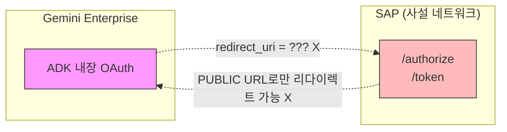
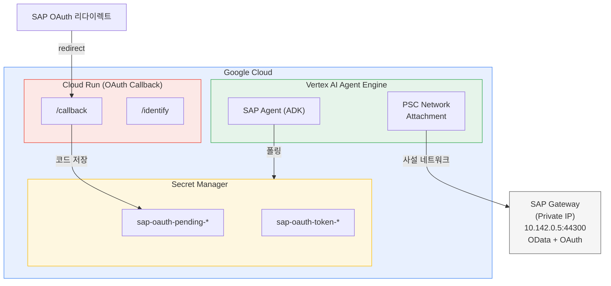
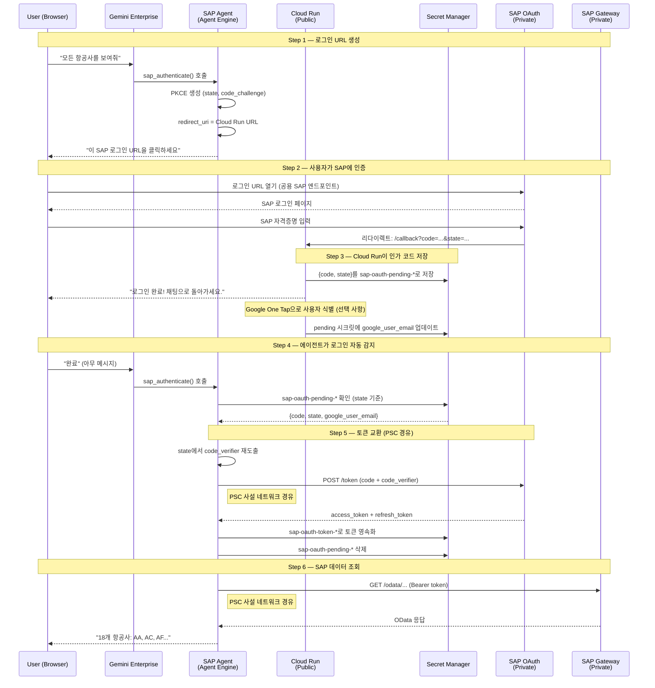
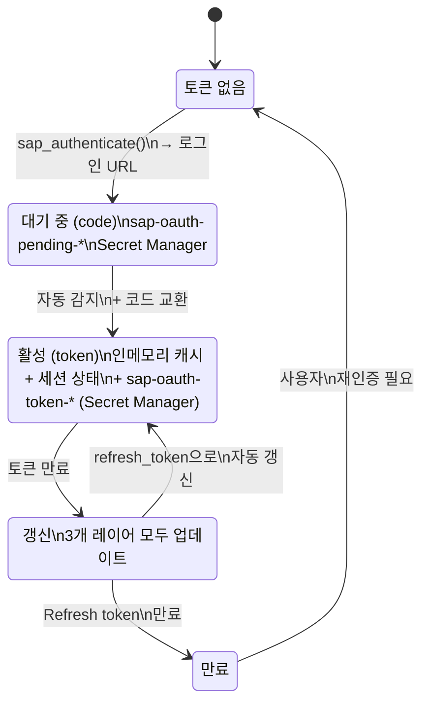

# Gemini Enterprise — SAP OAuth 2.0 통합

이 문서는 Gemini Enterprise에서 SAP 인증을 위해 ADK의 내장 OAuth 지원 대신 **커스텀 OAuth 2.0 흐름**을 구현한 이유와 방법을 설명합니다.

---

## 문제점

Gemini Enterprise를 온프레미스 SAP 시스템에 연결하려면 두 가지 상충되는 제약 조건을 해결해야 합니다:

| 제약 조건 | 상세 |
|---|---|
| **SAP은 사설 네트워크에 있음** | SAP Gateway는 사설 IP(예: `10.142.0.5:44300`)로만 접근 가능하며, 공용 인터넷에 노출되지 않음 |
| **Gemini Enterprise OAuth는 공용 엔드포인트 필요** | ADK의 내장 `get_auth_response()` / `request_credential()`은 공용 도메인으로만 리다이렉트 가능 — 사설 SAP OAuth 엔드포인트에 접근 불가 |

이는 다음을 의미합니다:
- **데이터 접근**은 가능: Agent Engine → PSC (Private Service Connect) → SAP Gateway (사설 IP)
- **OAuth 리다이렉트**는 불가: SAP OAuth 서버 → ??? → Agent Engine에 공용 콜백 엔드포인트 없음



> **Agent Engine에 공용 엔드포인트 없음** — 양방향 모두 리다이렉트 실패.

### ADK 내장 OAuth가 작동하지 않는 이유

ADK `AuthConfig`는 `sap_agent/sap_auth_config.py`에 정의되어 있습니다:

```python
auth_config = AuthConfig(
    auth_type=AuthType.OAUTH2,
    oauth2=OAuth2Auth(
        ...
        flows=OAuthFlows(
            authorization_code=OAuthFlowAuthorizationCode(
                authorization_url=os.getenv("SAP_OAUTH_AUTHORIZE_URL"),
                token_url=os.getenv("SAP_OAUTH_TOKEN_URL"),
            )
        ),
    ),
)
```

에이전트가 `tool_context.get_auth_response(auth_config)`를 호출하면, Gemini Enterprise가 내부적으로 OAuth 흐름을 처리하려고 합니다. 하지만:

1. **Gemini Enterprise가 `SAP_OAUTH_TOKEN_URL`에 접근 불가** — 사설 IP임
2. **SAP이 리다이렉트 불가** — Agent Engine에 공용 콜백 URL이 없음
3. **결과**: `get_auth_response()`는 항상 `None`을 반환

이는 `sap_agent/agent.py`에서 확인됩니다:

```python
# Gemini Enterprise does not support third-party OAuth consent
# via adk_request_credential, so we fall through to the existing
# custom OAuth flow that generates a login URL for the user.
logger.info("sap_authenticate: ADK get_auth_response returned None, "
            "falling through to custom OAuth flow")
```

---

## 해결책: Cloud Run OAuth 콜백 프록시

**Cloud Run 서비스**가 공용 OAuth 콜백 엔드포인트 역할을 하며, SAP의 공용 OAuth 리다이렉트와 Agent Engine의 사설 런타임 사이의 간격을 연결합니다.

### 아키텍처



### 두 개의 분리된 네트워크 경로

| 경로 | 용도 | 네트워크 | 방향 |
|------|------|----------|------|
| **데이터 경로** | OData 쿼리 | 사설 (PSC) | Agent Engine → SAP |
| **인증 경로** | OAuth 콜백 | 공용 (Cloud Run) | SAP → Cloud Run → Secret Manager → Agent Engine |

이 분리가 핵심 통찰입니다: **데이터는 사설 네트워크로 흐르지만, OAuth 리다이렉트는 프록시를 통해 공용 인터넷으로 흐릅니다**.

---

## 전체 OAuth 흐름



---

## 핵심 기술 결정

### 1. 결정적 PKCE Code Verifier

표준 PKCE는 Step 1(URL 생성)과 Step 5(토큰 교환) 사이에 랜덤 `code_verifier`를 생성하여 메모리에 저장합니다. Agent Engine의 서버리스 환경에서는 이 단계 사이에 컨테이너가 재시작되거나 요청이 다른 워커로 라우팅되어 인메모리 상태가 유실될 수 있습니다.

**해결책** (`sap_gw_connector/core/auth.py`):

```python
def _derive_code_verifier(self, state: str) -> str:
    """state + client_secret에서 PKCE code_verifier를 결정적으로 도출.

    HMAC-SHA256(client_secret, state) → code_verifier
    """
    secret_key = (self.config.oauth_client_secret or "default").encode()
    verifier_bytes = hmac.new(
        secret_key, state.encode(), hashlib.sha256
    ).digest()
    return base64.urlsafe_b64encode(verifier_bytes).rstrip(b"=").decode()
```

`client_secret`(환경 변수)과 `state`(콜백에서 반환)가 항상 사용 가능하므로, 어떤 워커에서든 언제든지 verifier를 재생성할 수 있습니다.

### 2. 세션 기반 사용자 식별

Gemini Enterprise는 실제 사용자 ID를 사용할 수 없을 때 모든 사용자에게 `default-user-id`를 전송합니다. 이를 공유 키로 사용하면 보안 문제가 발생합니다 — 여러 사용자의 토큰이 충돌할 수 있습니다.

**해결책** (`sap_agent/agent.py`):

```python
def _get_uid_from_context(tool_context):
    # 우선순위 1: 실제 사용자 ID ("default-user-id" 제외)
    if ctx_uid and ctx_uid != "default-user-id":
        return ctx_uid

    # 우선순위 2: 세션 상태 (OAuth 후 설정)
    state_uid = tool_context.state.get("user_id")  # 예: "admin@user.com"

    # 우선순위 3: 세션 기반 UID (세션별 고유)
    return f"session-{session_id}"  # 예: "session-50a0d951-ccce-..."
```

`default-user-id`는 시스템에 절대 진입하지 않습니다. 각 세션은 고유 식별자를 부여받으며, OAuth 완료 후 실제 이메일로 업그레이드됩니다.

### 3. 3단계 Pending 코드 감지

사용자가 로그인 후 "완료"라고 말하면, 에이전트는 대기 중인 인가 코드를 찾아야 합니다. 서버리스 환경에서는 이것이 어렵습니다:

| 단계 | 방법 | 사용 시점 |
|------|------|-----------|
| **Fast path 1** | 알려진 `state`로 시크릿 직접 조회 (인메모리 캐시) | 동일 워커, 동일 세션 |
| **Fast path 2** | 세션 상태(`sap_oauth_state`)의 `state`로 시크릿 직접 조회 | 크로스 워커, 동일 세션 |
| **Slow path** | 모든 `sap-oauth-pending-*` 시크릿 스캔 | 컨테이너 재시작, 새 세션 |

```python
# Fast path 1: 인메모리 상태
pending = _check_pending_oauth_code(strategy._last_auth_info["state"])

# Fast path 2: 세션 상태 (크로스 워커 유지)
saved_state = tool_context.state.get("sap_oauth_state")
pending = _check_pending_oauth_code(saved_state)

# Slow path: 모든 pending 시크릿 스캔
pending = _find_any_pending_oauth_code()
```

### 4. 세션 간 토큰 복구

Agent Engine이 후속 질문에 대해 새 세션을 생성할 수 있습니다. 새 세션은 다른 `session_id`를 가지므로, 이전 세션 UID로 저장된 토큰을 직접 찾을 수 없습니다.

**해결책**: Secret Manager의 `sap-oauth-token-*` 시크릿을 최후의 수단으로 스캔합니다:

```python
def _find_any_token_secret_uid():
    """기존 사용자별 토큰 시크릿을 스캔합니다."""
    for secret in client.list_secrets(...):
        if name.startswith("sap-oauth-token-"):
            data = load_secret_version(secret)
            return data.get("user_id")  # 예: "admin@user.com"
```

### 5. Google One Tap 사용자 식별

SAP 로그인 후, Cloud Run 콜백 페이지가 Google One Tap 프롬프트를 표시하여 사용자의 Google 계정을 식별합니다. 이를 통해 SAP OAuth 코드를 올바른 Google 사용자에게 연결합니다:

```
Cloud Run /callback → 성공 페이지
    → Google One Tap → 사용자의 Google 이메일
    → POST /identify → pending 시크릿에 google_user_email 업데이트
    → 에이전트가 이메일 읽기 → 토큰 저장에 user_id로 사용
```

이는 선택 사항입니다 — 인증 흐름은 이것 없이도 작동하지만, 사용자 식별을 통해 적절한 사용자별 토큰 관리가 가능해집니다.

---

## 인프라 요구 사항

### Private Service Connect (PSC)

PSC를 통해 Agent Engine이 SAP의 사설 IP에 접근할 수 있습니다:

```bash
# Agent Engine 컨테이너용 PSC 서브넷
gcloud compute networks subnets create psc-subnet \
    --range=192.168.10.0/28 \
    --purpose=PRIVATE_SERVICE_CONNECT

# Agent Engine을 VPC에 연결하는 네트워크 어태치먼트
gcloud compute network-attachments create agent-engine-attachment \
    --subnets=psc-subnet

# 방화벽: Agent Engine → SAP 허용
gcloud compute firewall-rules create allow-agent-engine-to-sap \
    --source-ranges="192.168.10.0/28" \
    --destination-ranges="10.142.0.5/32" \
    --rules=tcp:44300
```

### Cloud Run OAuth 콜백

```bash
cd cloud-run-oauth-callback/
gcloud run deploy sap-oauth-callback \
    --source . \
    --allow-unauthenticated \
    --set-env-vars GOOGLE_CLOUD_PROJECT=$PROJECT_ID
```

배포된 URL(예: `https://sap-oauth-callback-HASH.us-central1.run.app/callback`)을 SAP 트랜잭션 SOAUTH2에 리다이렉트 URI로 등록해야 합니다.

### Secret Manager

| 시크릿 패턴 | 용도 | 생성자 | 읽기 |
|---|---|---|---|
| `sap-credentials` | SAP OAuth 설정 (client_id, secret, URL) | 관리자 | Agent Engine |
| `sap-oauth-pending-*` | 콜백의 임시 인가 코드 | Cloud Run | Agent Engine |
| `sap-oauth-token-*` | 사용자별 access/refresh 토큰 | Agent Engine | Agent Engine |

### IAM 권한

| 서비스 계정 | 역할 | 범위 |
|---|---|---|
| Cloud Run 기본 SA | `secretmanager.admin` | `sap-oauth-pending-*` |
| Agent Engine SA (`agent-engine-sa`) | `secretmanager.viewer` | 프로젝트 (시크릿 목록 조회) |
| Agent Engine SA | `secretmanager.admin` | `sap-oauth-*` (pending 읽기/삭제, 토큰 관리) |

---

## 토큰 생명주기



### 토큰 영속성 레이어

| 레이어 | 범위 | 유지 조건 |
|---|---|---|
| **인메모리 캐시** | 워커 프로세스별 | 동일 워커 내 |
| **ADK 세션 상태** | 세션별 | 크로스 워커 (동일 세션) |
| **Secret Manager** | 사용자별 | 크로스 세션, 크로스 워커, 컨테이너 재시작 |

---

## 비교: ADK 내장 OAuth vs 커스텀 흐름

| 측면 | ADK 내장 OAuth | 커스텀 흐름 (이 프로젝트) |
|---|---|---|
| **사설 IP의 SAP** | 미지원 | PSC를 통해 지원 |
| **콜백 엔드포인트** | Gemini가 관리 | Cloud Run (공용) |
| **토큰 저장소** | ADK credential store | Secret Manager |
| **PKCE** | 표준 (인메모리) | 결정적 (HMAC) |
| **사용자 식별** | Gemini user_id | 세션 기반 UID + Google One Tap |
| **크로스 워커** | ADK 세션 | Secret Manager + 세션 상태 |
| **설정** | AuthConfig만 | AuthConfig + Cloud Run + PSC + Secret Manager |

### ADK 내장 OAuth를 대신 사용할 수 있는 경우

다음 조건이 **모두** 충족되는 경우:
1. SAP OAuth 엔드포인트가 **공용 도메인**으로 접근 가능 (사설 IP가 아닌)
2. Gemini Enterprise가 SAP 제공자에 대해 **서드파티 OAuth 동의**를 지원
3. 데이터 접근에 **PSC**가 필요 없음 (SAP이 공용 엔드포인트로 클라우드 호스팅)

이 경우 `sap_auth_config.py`의 `AuthConfig`가 직접 작동하며, Cloud Run + 커스텀 흐름이 필요 없습니다.

---

## 관련 문서

- [SAP OAuth 설정 가이드](AUTH_SAP_OAUTH.md) — SAP 트랜잭션 설정 (SICF, SOAUTH2, PFCG)
- [Cloud Run OAuth 콜백](CLOUD_RUN_OAUTH_CALLBACK.md) — 콜백 서비스 상세
- [배포 가이드](DEPLOYMENT_GUIDE.md) — PSC 설정을 포함한 전체 배포 절차
- [아키텍처](ARCHITECTURE.md) — 전체 시스템 아키텍처

---

- [English Documentation](../GEMINI_ENTERPRISE_SAP_OAUTH.md)
