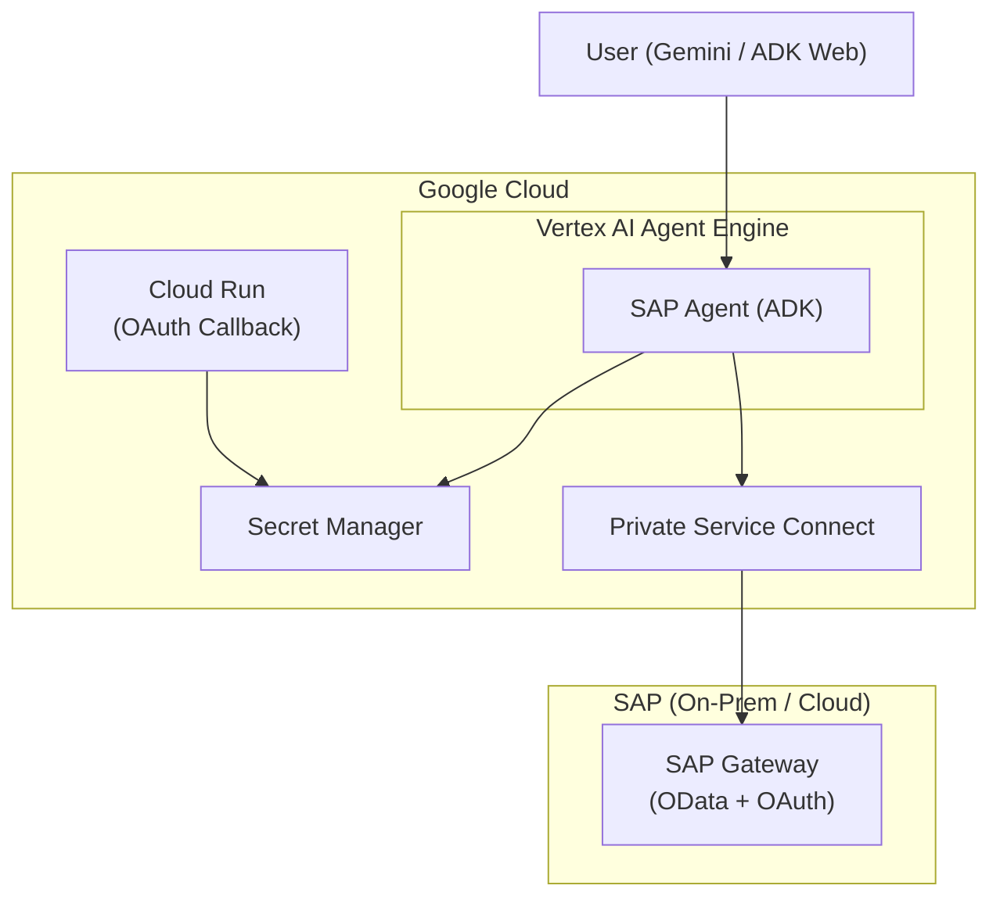

# SAP Agent with Google ADK

SAP Gateway OData 서비스에 연결하는 AI Agent로, [Google Agent Development Kit (ADK)](https://google.github.io/adk-docs/)로 구축되어 [Vertex AI Agent Engine](https://cloud.google.com/vertex-ai/docs/reasoning-engine/overview)을 통해 [Gemini Enterprise](https://cloud.google.com/gemini/enterprise)에 배포됩니다.

[](https://opensource.org/licenses/Apache-2.0)
[](https://www.python.org/)
[](https://google.github.io/adk-docs/)

---

## 프로젝트 소개

이 프로젝트는 **SAP 연동 AI Agent를 Gemini Enterprise에 배포**하여 최종 사용자가 Gemini 채팅 인터페이스에서 자연어로 SAP 데이터를 직접 조회할 수 있도록 합니다.

**목표**: 비즈니스 사용자가 OData, 트랜잭션 코드, 엔티티 세트 이름을 몰라도 SAP 데이터에 대해 질문할 수 있도록 합니다. Agent가 인증, 서비스 검색, 쿼리 구성을 자동으로 처리합니다.

```
User: "Show me all airlines"
Agent: authenticates → discovers Z_TRAVEL_RECO_SRV → queries AirlineSet → presents results

User: "Get sales order 91000092"
Agent: queries Z_SALES_ORDER_GENAI_SRV / zsd004Set(Vbeln='91000092') → presents details
```

**전체 동작 흐름:**

1. Agent는 **Google ADK**를 사용하여 Python 도구 함수(`sap_authenticate`, `sap_query`, `sap_list_services`, `sap_get_entity`)로 구성됩니다
2. **Vertex AI Agent Engine** — Google Cloud의 서버리스 AI Agent 런타임에 배포됩니다
3. 배포된 Agent는 **Gemini Enterprise**에 등록되어, 최종 사용자가 Gemini 채팅 UI를 통해 상호작용합니다
4. 각 사용자는 **SAP OAuth 2.0** (Authorization Code + PKCE)으로 자신의 SAP 자격증명으로 인증하며, 모든 쿼리는 해당 사용자의 SAP PFCG 권한으로 실행됩니다
5. **Cloud Run OAuth 콜백 프록시**가 SAP 로그인 리다이렉트를 자동으로 처리합니다 — 수동 코드 복사가 필요 없습니다
6. **Private Service Connect (PSC)**가 Agent Engine에서 온프레미스 SAP 시스템으로의 안전한 네트워크 연결을 제공합니다

## 아키텍처



## Agent 도구

| 도구 | 설명 |
|------|------|
| `sap_authenticate` | PKCE를 사용한 SAP OAuth 로그인. Step 1: 로그인 URL 반환. Step 2: Cloud Run 콜백을 통한 자동 감지. |
| `sap_list_services` | `services.yaml`에 설정된 SAP OData 서비스 목록 조회 |
| `sap_query` | `$filter`, `$select`, `$top`, `$skip`을 사용한 OData 엔티티 세트 쿼리 |
| `sap_get_entity` | 키로 단일 엔티티 조회 |

## 프로젝트 구조

```
sap-adk-agent/
├── sap_agent/
│   ├── agent.py                    # Agent 정의, 도구, 모델 설정
│   ├── sap_auth_config.py          # SAP OAuth용 ADK AuthConfig
│   ├── services.yaml               # SAP OData 서비스 정의
│   └── sap_gw_connector/
│       ├── config/
│       │   ├── settings.py         # SAPConnectionConfig (Pydantic)
│       │   ├── loader.py           # YAML 설정 로더
│       │   └── schemas.py          # 설정 스키마 정의
│       ├── core/
│       │   ├── auth.py             # OAuth 전략 (PKCE, 토큰 관리)
│       │   └── sap_client.py       # SAP Gateway HTTP 클라이언트
│       └── tools/                  # 도구 구현
├── cloud-run-oauth-callback/
│   └── main.py                     # OAuth 리다이렉트용 Cloud Run 서비스
├── scripts/
│   ├── deploy_agent_engine.py      # Vertex AI Agent Engine 배포
│   ├── setup_gcp_prerequisites.sh  # GCP API, 서비스 계정, IAM 설정
│   └── setup_psc_infrastructure.sh # Private Service Connect 설정
├── tests/
├── pyproject.toml
└── run_https.py                    # 로컬 OAuth용 HTTPS 개발 서버
```

## 빠른 시작

### 사전 요구사항

- Python 3.11+
- 결제가 활성화된 Google Cloud 프로젝트
- OAuth 2.0이 설정된 SAP Gateway 시스템 ([SAP OAuth 설정](AUTH_SAP_OAUTH.md) 참조)

### 1. 의존성 설치

```bash
git clone <repository-url>
cd sap-adk-agent
pip install -e ".[dev]"
```

### 2. 환경 설정

`sap_agent/.env` 파일을 생성합니다:

```bash
SAP_HOST=<your-sap-host>
SAP_PORT=44300
SAP_CLIENT=100
SAP_AUTH_TYPE=sap_oauth
SAP_OAUTH_CLIENT_ID=<your-oauth-client-id>
SAP_OAUTH_CLIENT_SECRET=<your-oauth-client-secret>
SAP_OAUTH_TOKEN_URL=https://<sap-host>:44300/sap/bc/sec/oauth2/token?sap-client=100
SAP_OAUTH_AUTHORIZE_URL=https://<sap-host>:44300/sap/bc/sec/oauth2/authorize?sap-client=100
SAP_OAUTH_REDIRECT_URI=https://localhost:8000/dev-callback
```

### 3. SAP 서비스 설정

`sap_agent/services.yaml`을 편집하여 OData 서비스를 정의합니다:

```yaml
gateway:
  base_url_pattern: "https://{host}:{port}/sap/opu/odata"
  service_catalog_path: "/sap/opu/odata/IWFND/CATALOGSERVICE;v=2/ServiceCollection"

services:
  - id: Z_SALES_ORDER_GENAI_SRV
    name: "Sales Order Service"
    path: "/SAP/Z_SALES_ORDER_GENAI_SRV"
    version: v2
    entities:
      - name: zsd004Set
        key_field: Vbeln
        description: "Sales orders"
```

### 4. 로컬 실행

```bash
# 옵션 A: ADK Web UI (HTTP - 간단하지만 OAuth 리다이렉트 불가)
adk web

# 옵션 B: HTTPS 서버 (SAP OAuth 리다이렉트에 필요)
mkdir -p certs
openssl req -x509 -newkey rsa:2048 -keyout certs/key.pem -out certs/cert.pem \
  -days 365 -nodes -subj '/CN=localhost'
python run_https.py
# https://localhost:8000 접속
```

## 배포

프로덕션 환경에서 Vertex AI Agent Engine에 배포하려면 [배포 가이드](DEPLOYMENT_GUIDE.md)를 참조하세요.

단계 요약:

```bash
# 1. GCP 리소스 설정
./scripts/setup_gcp_prerequisites.sh

# 2. SAP 전용 프라이빗 네트워크 설정 (온프레미스인 경우)
./scripts/setup_psc_infrastructure.sh

# 3. Secret Manager에 SAP 자격증명 저장
gcloud secrets create sap-credentials --replication-policy="automatic"
echo '{"auth_type":"sap_oauth","host":"...","oauth_client_id":"..."}' \
  | gcloud secrets versions add sap-credentials --data-file=-

# 4. Cloud Run OAuth 콜백 배포
cd cloud-run-oauth-callback && gcloud run deploy sap-oauth-callback --source . --allow-unauthenticated

# 5. Agent 배포
python scripts/deploy_agent_engine.py --project <PROJECT_ID>
```

## 설정 참조

### 환경 변수

| 변수 | 필수 | 기본값 | 설명 |
|------|------|--------|------|
| `SAP_HOST` | 예 | - | SAP Gateway 호스트명 또는 IP |
| `SAP_PORT` | 아니오 | 44300 | SAP Gateway HTTPS 포트 |
| `SAP_CLIENT` | 아니오 | 100 | SAP 클라이언트 번호 |
| `SAP_AUTH_TYPE` | 예 | sap_oauth | `sap_oauth`만 지원 |
| `SAP_OAUTH_CLIENT_ID` | 예 | - | OAuth 2.0 클라이언트 ID |
| `SAP_OAUTH_CLIENT_SECRET` | 예 | - | OAuth 2.0 클라이언트 시크릿 |
| `SAP_OAUTH_TOKEN_URL` | 예 | - | SAP OAuth 토큰 엔드포인트 |
| `SAP_OAUTH_AUTHORIZE_URL` | 예 | - | SAP OAuth 인가 엔드포인트 |
| `SAP_OAUTH_REDIRECT_URI` | 예 | - | OAuth 리다이렉트 URI |
| `SAP_OAUTH_SCOPE` | 아니오 | - | OAuth 스코프 |
| `SAP_AGENT_MODEL` | 아니오 | gemini-3.1-pro-preview | LLM 모델 오버라이드 |
| `SAP_VERIFY_SSL` | 아니오 | false | SSL 인증서 검증 |

### 기술 스택

| 구성요소 | 기술 |
|----------|------|
| AI Framework | Google ADK 1.27+ |
| LLM | Gemini (`SAP_AGENT_MODEL`로 설정 가능) |
| 배포 | Vertex AI Agent Engine |
| SAP 프로토콜 | OData v2 |
| 인증 | SAP OAuth 2.0 Authorization Code + PKCE |
| 자격증명 관리 | Google Secret Manager |
| 네트워크 | Private Service Connect (PSC) |

## 문서

| 문서 | 설명 |
|------|------|
| [배포 가이드](DEPLOYMENT_GUIDE.md) | Vertex AI Agent Engine 단계별 배포 가이드 |
| [SAP OAuth 설정](AUTH_SAP_OAUTH.md) | 개발 및 프로덕션 환경의 SAP OAuth 설정 |
| [빠른 참조](QUICK_REFERENCE.md) | 명령어, 환경 변수, 트러블슈팅 치트시트 |

## 테스트

```bash
# 단위 테스트 실행
pytest tests/

# 배포된 Agent 테스트
python scripts/test_deployed_sap_agent.py
```

## 라이선스

[Apache License 2.0](../../LICENSE)
