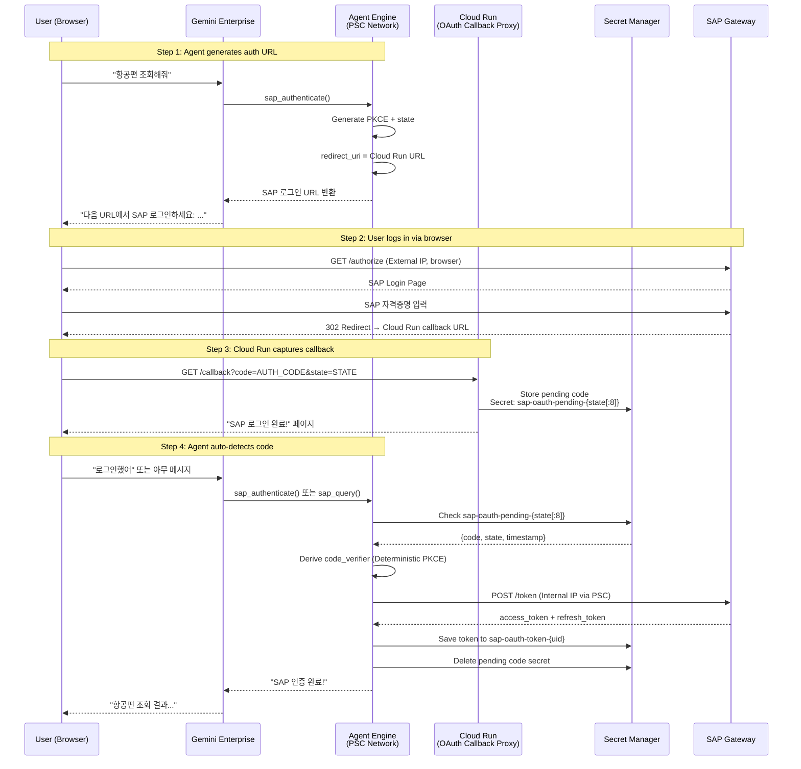

# Cloud Run OAuth Callback Proxy Design

**Date:** 2026-03-07
**Status:** Implemented
**Goal:** SAP OAuth 로그인 후 코드 수동 복사를 제거하고, Cloud Run을 통해 자동으로 callback을 수신하여 Agent Engine이 자동으로 token exchange를 수행

---

## Problem Statement

현재 프로덕션 환경(Agent Engine + Gemini Enterprise)에서 SAP OAuth Authorization Code flow는 사용자가 로그인 후 redirect URL에서 `code=...&state=...`를 수동으로 복사하여 채팅창에 붙여넣어야 합니다.

**현재 UX (5단계):**
1. Agent가 SAP 로그인 URL 제공
2. 사용자가 URL 클릭 → SAP 로그인
3. redirect URL에서 code+state 수동 복사
4. 채팅창에 붙여넣기
5. Agent가 code exchange 수행

**목표 UX (3단계):**
1. Agent가 SAP 로그인 URL 제공
2. 사용자가 URL 클릭 → SAP 로그인 → "로그인 완료" 페이지 확인
3. 채팅으로 돌아가서 계속 대화 → Agent가 자동으로 code 감지 및 exchange

---

## Architecture



---

## Components

### 1. Cloud Run Service (`sap-oauth-callback`)

경량 서비스. callback 수신 + Secret Manager 저장만 수행합니다.

**역할:**
- SAP OAuth redirect callback 수신 (`GET /callback?code=...&state=...`)
- code+state를 Secret Manager에 저장
- 사용자에게 "로그인 완료" HTML 페이지 반환
- SAP에 직접 접근하지 않음 (네트워크 격리 유지)

**엔드포인트:**

| Method | Path | Description |
|--------|------|-------------|
| GET | `/callback` | SAP OAuth redirect 수신 |
| GET | `/health` | Health check |

**구현 (Python/Flask, ~80줄):**

```python
import json
import os
import re
from datetime import datetime, timezone
from flask import Flask, request

from google.cloud import secretmanager

app = Flask(__name__)

PROJECT_ID = os.environ["GOOGLE_CLOUD_PROJECT"]
SECRET_PREFIX = "sap-oauth-pending"

def _sanitize_state(state: str) -> str:
    """state의 처음 8자를 secret ID로 사용 (alphanumeric만)."""
    safe = re.sub(r"[^a-zA-Z0-9_-]", "_", state[:16])
    return f"{SECRET_PREFIX}-{safe}"

def _get_sm_client():
    return secretmanager.SecretManagerServiceClient()

def _ensure_secret(client, secret_id: str):
    """Secret이 없으면 생성."""
    parent = f"projects/{PROJECT_ID}"
    secret_path = f"{parent}/secrets/{secret_id}"
    try:
        client.get_secret(request={"name": secret_path})
    except Exception:
        try:
            client.create_secret(request={
                "parent": parent,
                "secret_id": secret_id,
                "secret": {"replication": {"automatic": {}}},
            })
        except Exception as e:
            if "ALREADY_EXISTS" not in str(e):
                raise

@app.route("/callback")
def oauth_callback():
    code = request.args.get("code")
    state = request.args.get("state")
    error = request.args.get("error")

    if error:
        return f"<h2>Login Failed</h2><p>{error}</p>", 400

    if not code or not state:
        return "<h2>Invalid callback</h2><p>Missing code or state</p>", 400

    # Store in Secret Manager
    client = _get_sm_client()
    secret_id = _sanitize_state(state)
    _ensure_secret(client, secret_id)

    payload = json.dumps({
        "code": code,
        "state": state,
        "timestamp": datetime.now(timezone.utc).isoformat(),
    })

    secret_path = f"projects/{PROJECT_ID}/secrets/{secret_id}"
    client.add_secret_version(request={
        "parent": secret_path,
        "payload": {"data": payload.encode("UTF-8")},
    })

    return SUCCESS_HTML, 200

@app.route("/health")
def health():
    return {"status": "ok"}

SUCCESS_HTML = """<!DOCTYPE html>
<html><head><meta charset="UTF-8"><title>SAP Login Complete</title>
<style>
  body { font-family: -apple-system, sans-serif; display: flex;
         justify-content: center; align-items: center; min-height: 100vh;
         background: #f5f5f5; }
  .card { background: #fff; border-radius: 12px; padding: 40px;
          box-shadow: 0 2px 16px rgba(0,0,0,0.1); text-align: center;
          max-width: 400px; }
  .icon { font-size: 48px; margin-bottom: 16px; }
  h2 { color: #1a73e8; margin-bottom: 8px; }
  p { color: #666; line-height: 1.6; }
</style></head>
<body><div class="card">
  <div class="icon">&#10004;</div>
  <h2>SAP Login Complete</h2>
  <p>You can now close this tab and return to the chat.<br>
     The agent will automatically detect your login.</p>
</div></body></html>"""

if __name__ == "__main__":
    app.run(host="0.0.0.0", port=int(os.environ.get("PORT", 8080)))
```

**Dockerfile:**

```dockerfile
FROM python:3.12-slim
WORKDIR /app
COPY requirements.txt .
RUN pip install --no-cache-dir -r requirements.txt
COPY main.py .
CMD ["gunicorn", "--bind", "0.0.0.0:8080", "main:app"]
```

**requirements.txt:**

```
flask==3.1.0
gunicorn==23.0.0
google-cloud-secret-manager==2.23.1
```

---

### 2. Agent Engine 변경 (`agent.py`)

#### 2a. redirect_uri를 Cloud Run URL로 설정

Secret Manager의 `sap-credentials`에서:
```json
{
  "oauth_redirect_uri": "https://sap-oauth-callback-HASH.run.app/callback"
}
```

#### 2b. Pending code 자동 감지 (`_check_pending_oauth_code`)

`sap_authenticate()` 함수에 pending code 확인 로직 추가:

```python
def _check_pending_oauth_code(state: str) -> Optional[dict]:
    """Secret Manager에서 Cloud Run이 저장한 pending OAuth code를 확인.

    Args:
        state: OAuth state 파라미터 (auth URL 생성 시 반환된 값)

    Returns:
        {"code": "...", "state": "...", "timestamp": "..."} or None
    """
    sm = _get_secret_manager()
    if sm is None:
        return None

    project_id = os.getenv("GOOGLE_CLOUD_PROJECT")
    if not project_id:
        return None

    safe_state = re.sub(r"[^a-zA-Z0-9_-]", "_", state[:16])
    secret_id = f"sap-oauth-pending-{safe_state}"

    try:
        client = sm.SecretManagerServiceClient()
        name = f"projects/{project_id}/secrets/{secret_id}/versions/latest"
        response = client.access_secret_version(request={"name": name})
        data = json.loads(response.payload.data.decode("UTF-8"))

        # Verify state matches exactly
        if data.get("state") != state:
            return None

        # Check timestamp (expire after 10 minutes)
        from datetime import datetime, timezone, timedelta
        ts = datetime.fromisoformat(data["timestamp"])
        if datetime.now(timezone.utc) - ts > timedelta(minutes=10):
            logger.warning("Pending OAuth code expired (>10min)")
            return None

        return data
    except Exception:
        return None


def _cleanup_pending_oauth_secret(state: str):
    """사용 완료된 pending code secret 삭제."""
    sm = _get_secret_manager()
    if sm is None:
        return

    project_id = os.getenv("GOOGLE_CLOUD_PROJECT")
    if not project_id:
        return

    safe_state = re.sub(r"[^a-zA-Z0-9_-]", "_", state[:16])
    secret_id = f"sap-oauth-pending-{safe_state}"

    try:
        client = sm.SecretManagerServiceClient()
        secret_path = f"projects/{project_id}/secrets/{secret_id}"
        client.delete_secret(request={"name": secret_path})
        logger.info("Cleaned up pending OAuth secret: %s", secret_id)
    except Exception as e:
        logger.debug("Failed to cleanup pending secret: %s", e)
```

#### 2c. `sap_authenticate()` 수정

Step 1 (auth URL 생성) 후 Step 2 진입 시, `authorization_code`가 없어도 자동 감지:

```python
# sap_authenticate() 내부, Step 1 완료 후 재호출 시:

if not authorization_code and cached_auth is not None:
    strategy = cached_auth._strategy
    if strategy._last_auth_info:
        pending_state = strategy._last_auth_info.get("state")
        if pending_state:
            pending = _check_pending_oauth_code(pending_state)
            if pending:
                authorization_code = pending["code"]
                oauth_state = pending["state"]
                logger.info("Auto-detected OAuth code from Cloud Run callback")
                # Continue to Step 2 (code exchange)...
                # After successful exchange:
                _cleanup_pending_oauth_secret(pending_state)
```

---

### 3. SAP SOAUTH2 설정 변경

| 항목 | 변경 전 | 변경 후 |
|------|---------|---------|
| redirect_uri | `https://vertexaisearch.cloud.google.com/...` | `https://sap-oauth-callback-HASH.run.app/callback` |

---

### 4. Secret Manager 설정 변경

| Secret | 변경 |
|--------|------|
| `sap-credentials` | `oauth_redirect_uri` → Cloud Run URL |
| `sap-oauth-pending-*` | Cloud Run이 생성, Agent Engine이 읽고 삭제 (ephemeral) |
| `sap-oauth-token-*` | 변경 없음 (기존 token persistence) |

---

## Deployment

### Cloud Run 배포

```bash
# 1. 빌드 및 배포
gcloud run deploy sap-oauth-callback \
  --source . \
  --region us-central1 \
  --allow-unauthenticated \
  --set-env-vars GOOGLE_CLOUD_PROJECT=your-project-id \
  --memory 256Mi \
  --min-instances 0 \
  --max-instances 2

# 2. URL 확인
gcloud run services describe sap-oauth-callback \
  --region us-central1 \
  --format "value(status.url)"
# → https://sap-oauth-callback-xxxxx.run.app

# 3. Secret Manager 업데이트
# sap-credentials의 oauth_redirect_uri를:
# https://sap-oauth-callback-xxxxx.run.app/callback

# 4. SAP SOAUTH2에 동일한 redirect_uri 등록
```

### IAM 설정

| Service Account | Permission | Resource |
|----------------|------------|----------|
| Cloud Run SA | `secretmanager.secrets.create` | `sap-oauth-pending-*` |
| Cloud Run SA | `secretmanager.versions.add` | `sap-oauth-pending-*` |
| Agent Engine SA | `secretmanager.versions.access` | `sap-oauth-pending-*` |
| Agent Engine SA | `secretmanager.secrets.delete` | `sap-oauth-pending-*` |

---

## Security Considerations

| 위협 | 대응 |
|------|------|
| Cloud Run endpoint 악용 | state 검증 + 10분 TTL + 1회 사용 후 삭제 |
| code 가로채기 | PKCE (S256) 유지 — code만으로는 token 교환 불가 |
| Secret Manager 접근 | IAM으로 Cloud Run SA / Agent Engine SA만 허용 |
| CSRF | state 파라미터 전체 검증 (Cloud Run 저장, Agent Engine 확인) |
| Replay attack | timestamp 검증 (10분) + secret 삭제 |

---

## Network Topology

```
                    Internet (Public)              GCP Internal (VPC)
                    ─────────────────              ──────────────────
User Browser ──────►  SAP /authorize
                     (External IP)
                         │
                         ▼ redirect
              Cloud Run /callback ──────► Secret Manager
              (Public, no SAP access)     (sap-oauth-pending-*)
                                                   │
                                          Agent Engine reads
                                                   │
                                          Agent Engine ──PSC──► SAP /token
                                                              (Internal IP)
```

**Cloud Run은 SAP에 접근하지 않습니다.** 브라우저 redirect만 수신합니다.

---

## Comparison: Before vs After

| Metric | Before (Manual) | After (Cloud Run) | Improvement |
|--------|----------------|-------------------|-------------|
| User Auth Steps | 5 | 3 | -40% |
| Manual Copy-Paste | Required | Eliminated | 100% |
| Additional Infra | None | Cloud Run (256Mi, min 0) | Minimal |
| SAP IP Exposure | External IP (authorize only) | Same | No change |
| Token Exchange | Agent Engine → PSC → SAP | Same | No change |
| PKCE | Deterministic PKCE | Same | No change |
| Cost | $0 | ~$0 (scale-to-zero) | Negligible |

---

## Implementation Checklist

- [x] Cloud Run 서비스 코드 작성 (`sap-oauth-callback/`)
- [x] Cloud Run 배포 및 URL 확보
- [x] SAP SOAUTH2 redirect_uri 변경
- [x] Secret Manager `sap-credentials` redirect_uri 업데이트
- [x] `agent.py`에 `_check_pending_oauth_code()` 추가
- [x] `agent.py`에 `_cleanup_pending_oauth_secret()` 추가
- [x] `sap_authenticate()` Step 1 재호출 시 auto-detect 로직 추가
- [x] IAM 권한 설정 (Cloud Run SA, Agent Engine SA)
- [x] E2E 테스트
- [x] `docs/AUTH_SAP_OAUTH.md` 업데이트

### Implementation Notes

- **Cloud Run URL**: `https://sap-oauth-callback-110191959938.us-central1.run.app/callback`
- **Region**: us-central1, Memory: 256Mi, min 0 / max 2 instances
- **Cross-worker support**: `_find_any_pending_oauth_code()` 추가 — Agent Engine의 다중 워커 환경에서 특정 state를 모르는 경우에도 `sap-oauth-pending-*` 패턴으로 Secret Manager를 검색하여 pending code를 자동 감지. 이를 통해 워커 간 state 공유 없이도 OAuth callback을 처리할 수 있음.
