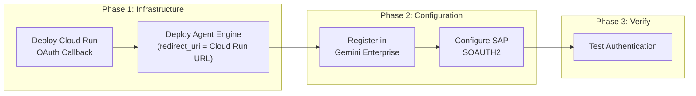
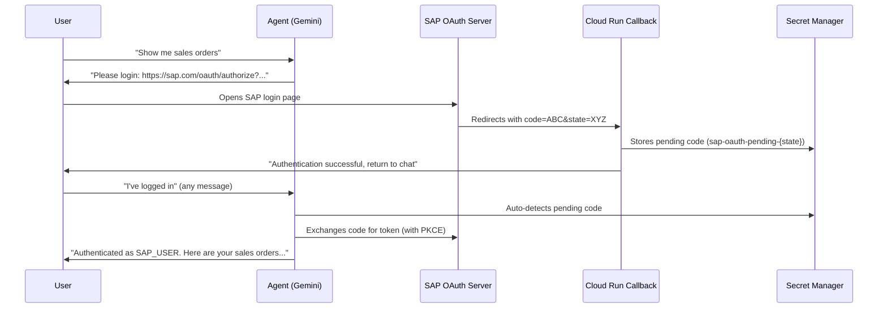

# README Deployment & Cloud Run Enhancement Plan

> **For Claude:** REQUIRED SUB-SKILL: Use superpowers:executing-plans to implement this plan task-by-task.

**Goal:** Enhance README.md's Deployment section with Cloud Run OAuth Callback Proxy documentation and comprehensive deployment workflow, matching the detail level in DEPLOYMENT_GUIDE.md.

**Architecture:** The README currently has a minimal Deployment section (lines 1389-1483) that lacks Cloud Run OAuth Callback Proxy content entirely and describes an outdated manual code-copy workflow. The Deployment Architecture diagram (lines 204-248) also omits Cloud Run. All content already exists in `docs/DEPLOYMENT_GUIDE.md` — this plan adapts and integrates it into README.md.

**Tech Stack:** Markdown, Mermaid diagrams

---

### Current State Analysis

**README.md issues identified:**

1. **Deployment Architecture diagram (line 204)** — Missing Cloud Run OAuth Callback Proxy node
2. **Deployment section (line 1389)** — Only 3-line deploy script commands, no Cloud Run content
3. **Gemini Enterprise section (line 1427)** — Describes outdated manual code-copy flow instead of Cloud Run auto-detect
4. **Table of Contents (line 20)** — Missing Cloud Run entry
5. **System Architecture diagram (line 152)** — Missing Cloud Run node
6. **Technology Stack table (line 46)** — Missing Cloud Run

**Reference:** `docs/DEPLOYMENT_GUIDE.md` lines 352-503 has complete Cloud Run content.

---

### Task 1: Update Table of Contents

**Files:**
- Modify: `README.md:12-26`

**Step 1: Add Cloud Run and restructure Deployment sub-items**

Replace lines 20-21:

```markdown
- [Deployment](#deployment)
  - [Gemini Enterprise Deployment (SAP OAuth)](#gemini-enterprise-deployment-sap-oauth)
```

With:

```markdown
- [Deployment](#deployment)
  - [Cloud Run OAuth Callback Proxy](#cloud-run-oauth-callback-proxy)
  - [Gemini Enterprise Deployment (SAP OAuth)](#gemini-enterprise-deployment-sap-oauth)
```

**Step 2: Verify by visual inspection**

Ensure the TOC has the new entry.

---

### Task 2: Update Technology Stack Table

**Files:**
- Modify: `README.md:46-58`

**Step 1: Add Cloud Run to the Technology Stack table**

After the `Network | Private Service Connect (PSC)` row (line 54), add:

```markdown
| OAuth Callback | Cloud Run (OAuth code auto-capture) |
```

**Step 2: Verify by visual inspection**

---

### Task 3: Update System Architecture Diagram

**Files:**
- Modify: `README.md:152-198`

**Step 1: Add Cloud Run node to the GCP section**

In the `GCP` subgraph (after `PSC` node at line 173), add Cloud Run:

```mermaid
        CR["Cloud Run<br/>(OAuth Callback Proxy)"]
```

Add connections:
- SAP redirects to Cloud Run: `SAPOAuth -.->|"3. Redirect with code"| CR`
- Cloud Run stores in Secret Manager: `CR -.->|"4. Store code"| SM`
- Agent auto-detects code: `Agent -.->|"5. Auto-detect code"| SM`

**Step 2: Verify Mermaid renders correctly**

---

### Task 4: Update Deployment Architecture Diagram

**Files:**
- Modify: `README.md:204-248`

**Step 1: Add Cloud Run to the Deployment Architecture diagram**

Add Cloud Run service node in the GCP section (outside VPC, since Cloud Run is serverless):

```mermaid
        subgraph CloudRun["Cloud Run"]
            CR["sap-oauth-callback<br/>(OAuth Code Capture)"]
        end
```

Add connections:
- `SAPGW -.->|"OAuth redirect"| CR`
- `CR -->|"stores code"| SM`
- `AE -->|"reads pending code"| SM`

Add style: `style CR fill:#66bb6a,color:#fff`

**Step 2: Verify diagram renders correctly**

---

### Task 5: Enhance Deployment Section with Cloud Run

**Files:**
- Modify: `README.md:1389-1425`

**Step 1: Rewrite Deployment section to include Cloud Run**

Replace the current minimal Deployment section (lines 1389-1425) with a comprehensive version:

```markdown
## Deployment

### Deployment Overview

Production deployment consists of two components:

| Component | Platform | Purpose |
|-----------|----------|---------|
| **SAP Agent** | Vertex AI Agent Engine | AI agent with SAP OData tools |
| **OAuth Callback Proxy** | Cloud Run | Captures SAP OAuth redirect codes automatically |



### Cloud Run OAuth Callback Proxy

The Cloud Run callback proxy eliminates manual code copy-paste in the SAP OAuth flow. Instead of users copying `code=...&state=...` from the redirect URL, Cloud Run captures the callback automatically and stores the code in Secret Manager for the agent to pick up.

#### How It Works



#### Deploy Cloud Run Service

```bash
# 1. Deploy sap-oauth-callback service
cd sap-oauth-callback/
gcloud run deploy sap-oauth-callback \
  --source . \
  --region us-central1 \
  --allow-unauthenticated \
  --set-env-vars GOOGLE_CLOUD_PROJECT=$PROJECT_ID \
  --memory 256Mi \
  --min-instances 0 \
  --max-instances 2

# 2. Get the deployed URL
gcloud run services describe sap-oauth-callback \
  --region us-central1 \
  --format "value(status.url)"
# Example: https://sap-oauth-callback-<HASH>.us-central1.run.app
```

#### Cloud Run IAM Permissions

```bash
PROJECT_ID="[your-project-id]"
AE_SA="agent-engine-sa@${PROJECT_ID}.iam.gserviceaccount.com"

# Grant Secret Manager viewer for listing pending secrets
gcloud projects add-iam-policy-binding $PROJECT_ID \
  --member="serviceAccount:$AE_SA" \
  --role="roles/secretmanager.viewer"

# Grant Secret Manager admin (scoped to sap-oauth-* secrets only)
gcloud projects add-iam-policy-binding $PROJECT_ID \
  --member="serviceAccount:$AE_SA" \
  --role="roles/secretmanager.admin" \
  --condition='expression=resource.name.startsWith("projects/'$PROJECT_ID'/secrets/sap-oauth-"),title=sap-oauth-secrets'
```

| Service Account | Role | Resource | Purpose |
|----------------|------|----------|---------|
| Cloud Run SA (default compute) | `secretmanager.secrets.create`, `secretmanager.versions.add` | `sap-oauth-pending-*` | Store pending OAuth codes |
| Agent Engine SA | `roles/secretmanager.viewer` | Project | List secrets to find pending codes |
| Agent Engine SA | `roles/secretmanager.admin` (conditional) | `sap-oauth-pending-*`, `sap-oauth-token-*` | Read/delete pending codes, manage per-user tokens |

### Vertex AI Agent Engine Deployment

```bash
# New deployment
python scripts/deploy_agent_engine.py --project <your-project-id>

# Update existing deployment
python scripts/deploy_agent_engine.py --project <your-project-id> \
  --update projects/<NUM>/locations/us-central1/reasoningEngines/<ENGINE_ID>
```

The deployment script performs:
1. Loads SAP credentials from Secret Manager
2. Wraps Agent as `AdkApp` for Agent Engine compatibility
3. Deploys with PSC network attachment and environment variables
4. Excludes `oauth_redirect_uri` from env_vars (`RUNTIME_ONLY_KEYS`) — loaded at runtime from Secret Manager

### Deployment Configuration

> **Note**: Replace placeholder values with your actual GCP project settings.

| Item | Example Value | Description |
|------|---------------|-------------|
| Region | us-central1 | Deployment region |
| Model | gemini-3.1-pro-preview | LLM model (configurable via `SAP_AGENT_MODEL`) |
| Network | PSC (Private Service Connect) | Private network to SAP |
| Service Account | agent-engine-sa@{PROJECT}.iam.gserviceaccount.com | Agent Engine SA |
| Staging Bucket | gs://{PROJECT}_cloudbuild | Package staging |

### Verify Deployment

```bash
# Check Agent Engine list
gcloud ai reasoning-engines list --region=us-central1

# View agent details
gcloud ai reasoning-engines describe <ENGINE_ID> --region=us-central1

# Check Cloud Run service
gcloud run services describe sap-oauth-callback --region us-central1
```

For detailed deployment guide, see [docs/DEPLOYMENT_GUIDE.md](docs/DEPLOYMENT_GUIDE.md).
```

**Step 2: Verify that the new content renders correctly**

---

### Task 6: Update Gemini Enterprise Deployment Section

**Files:**
- Modify: `README.md` (the Gemini Enterprise section that follows Deployment)

**Step 1: Rewrite to reference Cloud Run as the recommended approach**

Replace the current Gemini Enterprise section (lines 1427-1483) with:

```markdown
### Gemini Enterprise Deployment (SAP OAuth)

When deploying to Gemini Enterprise, the `oauth_redirect_uri` must be set **after** the agent is registered. The recommended approach uses the **Cloud Run OAuth Callback Proxy** to eliminate both the agent ID dependency and manual code copy-paste.

#### Recommended: Cloud Run Callback (Auto-Detect)

```bash
# 1. Deploy Cloud Run callback (if not already deployed)
cd sap-oauth-callback/
gcloud run deploy sap-oauth-callback --source . --region us-central1 --allow-unauthenticated \
  --set-env-vars GOOGLE_CLOUD_PROJECT=$PROJECT_ID --memory 256Mi

# 2. Deploy Agent Engine
python scripts/deploy_agent_engine.py --project <your-project-id>
# → Resource Name: projects/.../reasoningEngines/<ENGINE_ID>

# 3. Register in Gemini Enterprise
# → Agent ID assigned (e.g., 2446305029283808184)

# 4. Register redirect_uri in SAP Transaction SOAUTH2
# Use Cloud Run URL: https://sap-oauth-callback-<HASH>.us-central1.run.app/callback

# 5. Update Secret Manager with Cloud Run callback URL
echo '{
  "auth_type": "sap_oauth",
  "host": "<your-sap-internal-ip>",
  "port": 44300,
  "client": "100",
  "oauth_client_id": "<CLIENT_ID>",
  "oauth_client_secret": "<CLIENT_SECRET>",
  "oauth_token_url": "https://<SAP_HOST>:44300/sap/bc/sec/oauth2/token?sap-client=100",
  "oauth_authorize_url": "https://<SAP_HOST>:44300/sap/bc/sec/oauth2/authorize?sap-client=100",
  "oauth_redirect_uri": "https://sap-oauth-callback-<HASH>.us-central1.run.app/callback",
  "oauth_scope": "<SCOPE>"
}' | gcloud secrets versions add sap-credentials --data-file=-

# 6. Test: ask the agent "show me all airlines"
# → Click login URL → SAP login → auto-detected → authenticated
```

> **No manual code copy-paste required.** The Cloud Run callback captures the OAuth code automatically. When the user returns to the chat, the agent auto-detects the pending code from Secret Manager.

#### Alternative: Direct Gemini Enterprise Redirect URI

If Cloud Run is not available, you can use Gemini Enterprise's built-in redirect URI. In this case, the user must manually copy the authorization code from the redirect URL.

```bash
# Set redirect_uri to Gemini Enterprise's callback URL
"oauth_redirect_uri": "https://vertexaisearch.cloud.google.com/home/cid/<CID>/r/agent/<AGENT_ID>/session/-"
```

#### Deploy-Time vs Runtime Config Split

| Category | Timing | Storage | Description |
|----------|--------|---------|-------------|
| SAP_HOST, CLIENT_ID, etc. | Deploy-time | env_vars (static) | Fixed when Agent Engine is created |
| oauth_redirect_uri | **Post**-deployment | Secret Manager (runtime) | Can be set after agent ID is assigned |

- **Deploy script**: `RUNTIME_ONLY_KEYS = {"oauth_redirect_uri"}` excludes it from deploy-time env_vars
- **Agent**: `_load_runtime_secrets()` loads `oauth_redirect_uri` from Secret Manager at runtime
- **PKCE**: Deterministic `HMAC-SHA256(client_secret, state)` — no session state needed across container restarts

#### Updating redirect_uri (No Redeployment Required)

```bash
# Just update Secret Manager — the agent reads it at runtime
echo '{
  ...
  "oauth_redirect_uri": "https://sap-oauth-callback-<HASH>.us-central1.run.app/callback",
  ...
}' | gcloud secrets versions add sap-credentials --data-file=-
```
```

**Step 2: Verify the section renders correctly**

---

### Task 7: Commit

**Step 1: Run tests to verify no regressions**

```bash
.venv/bin/python -m pytest tests/ -v
```

Expected: All 81 tests pass (2 skipped).

**Step 2: Commit**

```bash
git add README.md docs/plans/2026-03-07-readme-deployment-enhancement.md
git commit -m "docs: enhance README deployment section with Cloud Run OAuth callback proxy"
```

**Step 3: Push**

```bash
git push
```
